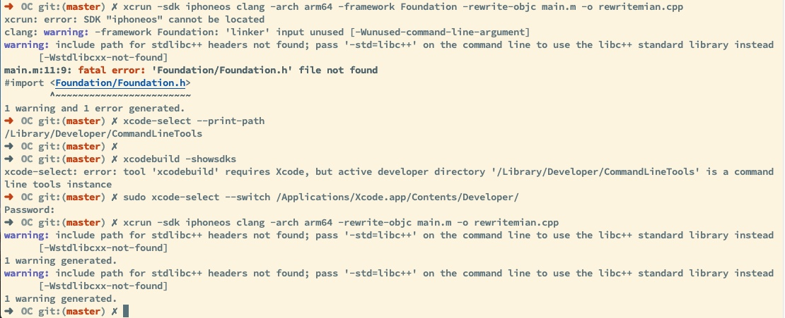

### commandline tool 和 XCode路径问题
   xcrun: error: SDK "iphoneos" cannot be located
   1. 查看xcode-select的路径
   `xcode-select --print-path`
   2. XCode的路径判断
   `xcodebuild -showsdks`
   3. 修改开发目录
   `sudo xcode-select --switch /Applications/Xcode.app/Contents/Developer/`

  