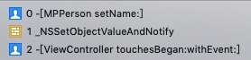

# KVO

[ida7在mojave下crash解决](https://blog.csdn.net/fjh658/article/details/81542109)

https://github.com/fjh658/IDA7.0_SP
下载工程中编译好的libqcocoa1.dylib
将其copy到 /Applications/IDA Pro 7.0/ida.app/Contents/PlugIns/platforms/路径下即可


越狱机通过ifunbox可以找到系统Foundation等框架的位置
Device/System/Library/Caches/com.apple.dyld/dyld_shared_cache_arm64
当然还有可能有其他架构版本。

下载[dyld](https://opensource.apple.com/tarballs/dyld/)可参照 [这个教程](https://www.jianshu.com/p/103d25ac05f4)生成dsc_extractor解出Foundation框架等

解出来的foundation可以通过ida64看一下汇编可以大概看到调用的方法。

```
@interface MPPerson : NSObject
@property (nonatomic, copy) NSString *name;
@end

@implementation MPPerson
- (void)didChangeValueForKey:(NSString *)key {
    printf("begin  %s\n", __func__);
    [super didChangeValueForKey:key];
    printf("begin  %s\n", __func__);
}
- (void)setName:(NSString *)name {
    printf("begin  %s\n", __func__);
    _name = [name copy];
    printf("begin  %s\n", __func__);
}
- (void)willChangeValueForKey:(NSString *)key {
    printf("begin  %s\n", __func__);
    [super willChangeValueForKey:key];
    printf("end    %s\n", __func__);
}
@end

@interface ViewController ()
@property (nonatomic, strong) MPPerson *person;
@end

@implementation ViewController
- (void)viewDidLoad {
    [super viewDidLoad];
    [self.person addObserver:self forKeyPath:@"name" options:NSKeyValueObservingOptionNew|NSKeyValueObservingOptionOld context:nil];
}
- (void)touchesBegan:(NSSet<UITouch *> *)touches withEvent:(UIEvent *)event {
    self.person.name = [NSString stringWithFormat:@"killer%d", (arc4random() % 100)];
}
- (void)observeValueForKeyPath:(NSString *)keyPath ofObject:(id)object change:(NSDictionary<NSKeyValueChangeKey,id> *)change context:(void *)context {
    printf("observeValueForKeyPath");
}
@end
```
触发touchesBegan方法，可以断到如下调用栈



在lldb可以看到
```
(lldb) p self.person->isa
(Class) $0 = NSKVONotifying_MPPerson
```

重写了
- 观察值的set方法
- class
- dealloc
- _isKVOAm


nm命令可以导出符号表
nm Foundation | grep ValueAndNotify
就可以看到foundation框架中，实现kvo所使用的set方法了。

