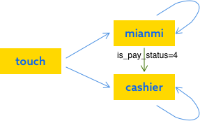

## 出租车支付流程

###支付方式
目前只支持两种支付方式
- 免密支付
- 收银台

通过2个接口获取支付方式，由is_pay_status来标示支付状态
- 1: 已线上支付
- 2: 已线下支付
- 3: 需要免密支付
- 4: 需要收银台支付


进入支付页会调getpayinfo设置支付方式，后面轮询detail接口来指定支付方式
###支付接口
```
order/taxi/payreq
```
参数 req_type = **contract** 则触发后台免密支付
参数 req_type = **cashier** 则是获取收银台参数，获得参数后直接调用钱包sdk

###支付流程
支付流程大体分为3个状态来流转
```
typedef NS_ENUM(NSUInteger, payFlowStatus) {
	payFlowStatusNeedTouch,
	payFlowStatusMianMI,
	payFlowStatusCashier,
};
```
进入支付页默认状态为needtouch，也就是需要触发的状态，端上不会自动发起扣款。
- needtouch状态并不会有动作
- mianmi状态会发起免密支付
- cashier状态会发起收银台支付 

下面是状态的流转图


蓝箭头：用户点击支付
绿箭头：免密支付失败
箭头指向的方向为当前轮询到的支付方式