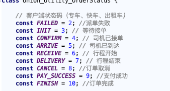

# 订单状态码
[地址](http://icode.baidu.com/repos/baidu/yongcheserver/order/blob/master:conf/order/status.conf)
#客户端

#等待接单
order_init : 0
#无车取消
order_no_driver : 6
#下单失败
order_failed : 7
#接单超时
order_timeout : 8
#乘客取消（司机接单前）
customer_cancel_bc : 9
 
#司机接单
order_confirm : 10
#司机改派 (司机到达前)
reassign : 11
#改派超时 (司机到达前)
reassign_timeout : 17
#司机取消 (司机到达前)
driver_cancel_ba : 18
#乘客取消 (司机到达前)
customer_cancel_ba : 19
 
#司机到达
order_arrive : 20
#司机取消 (行程开始前)
driver_cancel_br : 28
#乘客取消 (行程开始前)
customer_cancel_br : 29
 
#行程开始
order_receive : 30
 
#行程结束
order_delivery : 40
#司机取消(行程结束前)
driver_cancel_bp : 47
#客服取消（支付前）
cs_cancel_bp : 48
#支付失败
order_pay_failed : 49
 
#线上支付
order_pay_success : 50
#线下支付
order_pay_offline : 51
#司机取消（支付后）- 仅长途顺风车
driver_cancel_bf : 58
#乘客取消（支付后）- 仅长途顺风车
customer_cancel_bf : 59
 
#乘客评价司机
customer_comment : 60
#司机评价乘客
driver_comment : 61
#订单完成
order_finish : 70