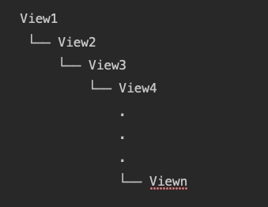

# 触摸事件
### 具有响应事件能力的对象
- UIResponder
    - UIApplication
    - UIViewController
    - UIView(UIWindow)
- UIGestureRecognizer
    - UITapGestureRecognizer
    - UIPinchGestureRecognizer
    - UIRotationGestureRecognizer
    - UISwipeGestureRecognizer
    - UIPanGestureRecognizer
    - UIScreenEdgePanGestureRecognizer
    - UILongPressGestureRecognizer
- UIControl
    - UIButton
    - UISwitch
    - UISegmentedControl
    - 等

### 事件的封装

- UITouch
    - 一个手指一次触摸屏幕，就对应生成一个UITouch对象。多个手指同时触摸，生成多个UITouch对象。
    - 多个手指先后触摸，系统会根据触摸的位置判断是否更新同一个UITouch对象。若两个手指一前一后触摸同一个位置（即双击），那么第一次触摸时生成一个UITouch对象，第二次触摸更新这个UITouch对象（UITouch对象的 tap count 属性值从1变成2）；若两个手指一前一后触摸的位置不同，将会生成两个UITouch对象，两者之间没有联系。
    - 个UITouch对象记录了触摸的一些信息，包括触摸时间、位置、阶段、所处的视图、窗口等信息。
- UIEvent
    - 触摸的目的是生成触摸事件供响应者响应，一个触摸事件对应一个UIEvent对象，其中的 type 属性标识了事件的类型（之前说过事件不只是触摸事件）。
    - UIEvent对象中包含了触发该事件的触摸对象的集合，因为一个触摸事件可能是由多个手指同时触摸产生的。触摸对象集合通过 allTouches 属性获取

### 寻找响应者

- hit-testing
    - 自下而上
    - 路线：application->后添加的view（UIWindow也是view）
    - 不可响应：
        - userInteractionEnabled = NO
        - hidden = YES 如果父视图隐藏，那么子视图也会隐藏
        - alpha < 0.01 如果设置一个视图的透明度<0.01，会直接影响子视图的透明度。alpha：0.0~0.01为透明。
    - **hitTest:withEvent:**

    ```
        - (UIView *)hitTest:(CGPoint)point withEvent:(UIEvent *)event{
            //3种状态无法响应事件
            if (self.userInteractionEnabled == NO || self.hidden == YES ||  self.alpha <= 0.01) return nil; 
            //触摸点若不在当前视图上则无法响应事件
            if ([self pointInside:point withEvent:event] == NO) return nil; 
                //从后往前遍历子视图数组 
                int count = (int)self.subviews.count; 
                for (int i = count - 1; i >= 0; i--) 
                { 
                    // 获取子视图
                    UIView *childView = self.subviews[i]; 
                    // 坐标系的转换,把触摸点在当前视图上坐标转换为在子视图上的坐标
                    CGPoint childP = [self convertPoint:point toView:childView]; 
                    //询问子视图层级中的最佳响应视图
                    UIView *fitView = [childView hitTest:childP withEvent:event]; 
                    if (fitView) 
                    {
                    //如果子视图中有更合适的就返回
                    return fitView; 
                    }
                } 
                //没有在子视图中找到更合适的响应视图，那么自身就是最合适的
                return self;    
            }       
    ```
        
   - **pointInside:withEvent:**
        - 判断触摸点是否在自身坐标范围内。默认实现是若在坐标范围内则返回YES，否则返回NO。
   - 注意点击一次，会走两遍hittest。因为状态不同一次touchbegin一次touchend
   - 假设视图树结构如下，如果viewn有部分超出父视图且要响应事件，那么从view1-viewn-1的pointInside:withEvent:都要返回yes，这样就要在被超出的父视图重写pointInside:withEvent:并在对应超出区域返回yes（常见的case就是tab中间的圆形按钮如闲鱼
    
    
    
### 事件的传递

上面已经找到了最佳响应者，下面就是事件传递到响应者。
    UIApplication会通过sendEvent:将事件传递给window，然后window同样通过这个方法传递给最佳响应者view
    UIApplication ——> UIWindow ——> view
    如何找到对应的window和view呢？应该已经猜到了，就是hittest的过程中呗。
    
    
### 事件的响应（响应链）
最佳响应者是第一响应的对象，而不是唯一的。响应链则是沿着这条链可以让这条链上的对象也响应这个事件。
    这条链是通过nextResponder来串联的（UIResponder属性），然后通过**touchesBegan:withEvent:**方法控制传递
* 不拦截（默认操作），会沿着响应链传递下去
* 拦截，且不往下分发事件。重写touchesBegan:withEvent:且不掉父类实现
* 拦截，且往下分发。重写touchesBegan:withEvent:且调用父类

**nextResponder**
* UIView
          若视图是控制器的根视图，则其nextResponder为控制器对象；否则，其nextResponder为父视图。
* UIViewController
          若控制器的视图是window的根视图，则其nextResponder为窗口对象；若控制器是从别的控制器present出来的，则其nextResponder为presenting view controller。
* UIWindow
          nextResponder为UIApplication对象。
* UIApplication
          若当前应用的app delegate是一个UIResponder对象，且不是UIView、UIViewController或app本身，则UIApplication的nextResponder为app delegate。
* 可以重写nextResponder方法改变响应链

### UIGestureRecognizer
上结论：
* UIGestureRecognizer处理事件的方法和UIResponder是相同的四个（touchesBegan等四个，并不是子类哦）
* UIGestureRecognizer的优先级比UIResponder。例如你点击了viewn，正好viewn上又 个手势识别器tap，那么viewn上的tap会先响应。也就是说tap的touchesBegan先被调用，然后viewn的touchesBegan在被调用。当然tap会被成功识别，然后调用对应的action。而viewn的则会被cancel掉。
* UIGestureRecognizer也是在hittesting的过程中收集的，会记录在UITouch名为gestureRecognizers的数组属性中。只有响应链中的才会被记录,响应链越靠前的UIGestureRecognizer在数组中的位置也越靠前。例如红色view有手势识别器tap0，蓝色view有手势识别器tap1，蓝色view添加到红色view上，这时点击蓝色view，tap1在数组0位，tap0在数组1位。
* gestureRecognizers数组中的UIGestureRecognizer的touchesBegan等都会被调用，且不一定符合数组的顺序调用，即上面的case，有可能蓝色view先被调到，也有可能红色view先被调到，还有个demo测试得出的结论，只要不退出这个页面如果蓝色view先被调到，那么每次点击都是蓝色先被调到。且和靠前的UIGestureRecognizer在touchesBegan中是否调用super无关，不像前面的UIResponder在touchesBegan中调用super事件就会在响应链中传递下去。
* gestureRecognizers的touchesBegan默认实现是调用super的，这样gestureRecognizers数组中只有第一个UIGestureRecognizer的action会被调用到。其他UIGestureRecognizer也成功调了touchesBegan到touchesEnd，但是不会调到对应的action。如果重写了touchesBegan且不调用super（这里指gestureRecognizers数组第一个）那么数组中所有UIGestureRecognizer的touchesBegan到touchesEnd还是会成功调到，但是第一个UIGestureRecognizer没有调到对应action，第二个会调到，也就是在沿着数组的顺序在找调用了super的UIGestureRecognizer，找到了就调用对应action并停止查找。如果这时可以响应的gestureRecognizers都没有调super那么view的touchesBegan到touchesEnd就会被成功调用。否则就会走touchesBegan到touchesCancel

### UIGestureRecognizer->UIResponder混搭
* Window先将绑定了触摸对象的事件传递给触摸对象上绑定的手势识别器，再发送给触摸对象对应的hit-tested view。
* 手势识别器识别手势期间，若触摸对象的触摸状态发生变化，事件都是先发送给手势识别器再发送给hit-test view。
* 手势识别器若成功识别了手势，则通知Application取消hit-tested view对于事件的响应，并停止向hit-tested view发送事件；
* 若手势识别器未能识别手势，而此时触摸并未结束，则停止向手势识别器发送事件，仅向hit-test view发送事件。
* 若手势识别器未能识别手势，且此时触摸已经结束，则向hit-tested view发送end状态的touch事件以停止对事件的响应。
    
UIGestureRecognizer有3个属性可以控制上面的流程
1. cancelsTouchesInView
    1. 默认为YES。表示当手势识别器成功识别了手势之后，会通知Application取消响应链对事件的响应，并不再传递事件给hit-test view。
    2. 若设置成NO，表示手势识别成功后不取消响应链对事件的响应，事件依旧会传递给hit-test view。
2. delaysTouchesBegan
    1. 默认为NO。默认情况下手势识别器在识别手势期间，当触摸状态发生改变时，Application都会将事件传递给手势识别器和hit-tested view；
    2. 若设置成YES，则表示手势识别器在识别手势期间，截断事件，即不会将事件发送给hit-tested view。
3. delaysTouchesEnded
    1. 默认为YES。当手势识别失败时，若此时触摸已经结束，会延迟一小段时间（0.15s）再调用响应者的 touchesEnded:withEvent:；
    2. 若设置成NO，则在手势识别失败时会立即通知Application发送状态为end的touch事件给hit-tested view以调用 touchesEnded:withEvent: 结束事件响应。
### UIControl
UIControl是系统提供的能够以target-action模式处理触摸事件的控件，典型代表是UIButton、UISegmentedControl、UISwitch等都是UIControl的子类。需要注意的是，UIConotrol是UIView的子类，因此本身也具备UIResponder应有的身份。

不同于UIResponder以及UIGestureRecognizer通过 touches 系列跟踪事件方法，UIControl有其独特的跟踪方式：
```
- (BOOL)beginTrackingWithTouch:(UITouch *)touch withEvent:(nullable UIEvent *)event;
- (BOOL)continueTrackingWithTouch:(UITouch *)touch withEvent:(nullable UIEvent *)event;
- (void)endTrackingWithTouch:(nullable UITouch *)touch withEvent:(nullable UIEvent *)event;
- (void)cancelTrackingWithEvent:(nullable UIEvent *)event;
```
* UIControl只能接收单点触控，因此接收的参数是单个UITouch对象
* 上面4个方法分别用来跟踪触摸的开始、滑动、结束、取消
* UIControl的 Tracking 系列方法是在 touch 系列方法内部调用的（UIControl重写了touch系列方法）
* UIControl成功识别事件后会调用**sendAction:to:forEvent:**通知应用，然后Application对象再通过**sendAction:to:from:forEvent:**向target发送action
* 可以重写上面的两个方法替换响应对应和响应方法
* 若不指定target，即 addTarget:action:forControlEvents: 时target传空，那么当事件发生时，Application会在响应链上从上往下寻找能响应action的对象。
### UIControl和UIGestureRecognizer
* 同一视图上，UIGestureRecognizer优先级更高
* 同一视图上，UIGestureRecognizer的cancelsTouchesInView=NO时，2者均可响应
* 非自定义的UIControl优先级高于父视图以上的UIGestureRecognizer
* 自定义UIControl的优先级还是低于UIGestureRecognizer

### 总结
* UIRespnder、UIControl、UIGestureRecognizer优先级递增
    * 其中UIGestureRecognizer不分视图层级的完全碾压UIRespnder
    * 非自定义UIControl
        * UIGestureRecognizer和UIControl相同层级或者UIGestureRecognizer更高时它优先级更高
        * 当UIControl层级更高时，优先级高于UIGestureRecognizer
    * 自定义UIControl
        * UIGestureRecognizer不分视图层级的优先级更高


[参考](https://www.jianshu.com/p/c294d1bd963d)

                
                


    

                  
                  
   


    


