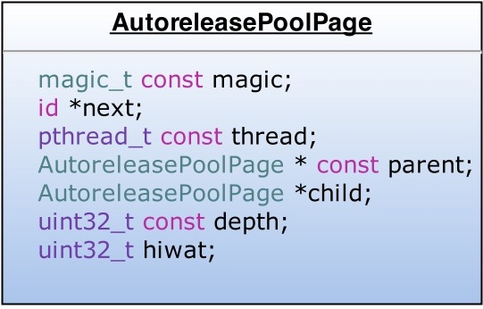
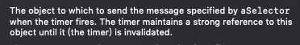
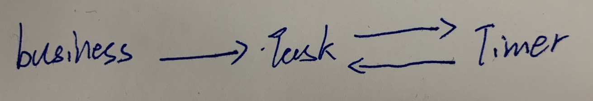
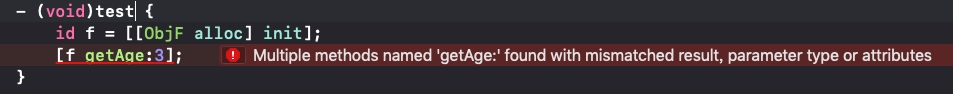

# high performance iOS app

[Clang文档](http://clang.llvm.org/docs/AutomaticReferenceCounting.html) [apple文档1](https://developer.apple.com/library/archive/documentation/Cocoa/Conceptual/MemoryMgmt/Articles/MemoryMgmt.html) [apple文档2](https://developer.apple.com/library/archive/releasenotes/ObjectiveC/RN-TransitioningToARC/Introduction/Introduction.html)
[sunnyxx](http://blog.sunnyxx.com/2014/10/15/behind-autorelease/) [interview](https://hit-alibaba.github.io/interview/iOS/ObjC-Basic/MM.html)

### 内存消耗
“The iOS virtual memory model does not include swap memory, which means that, unlike with desktop apps, the disk cannot be used to page memory. The end result is that the apps are restricted to available RAM, which is used not only by the app in the foreground but also by the operating system services and potentially also by background tasks being run by other apps.”

应用的内存消耗分为两部分，栈和堆

#### 栈
每个线程都有专用的栈空间，线程退出则栈空间释放。由于栈空间很小，所以有以下限制：
* 最大递归调用方法数
    * 每个方法都有对应的栈帧，栈帧消耗一定空间
* 一个方法中最多变量个数
    * 所有变量都会占用栈帧，也就意味着消耗空间
* 最大视图渲染层级
    * 嵌套视图会层层调用layoutSubViews和drawRect，层级过深则会栈溢出
    
####堆
每个进程的所有线程共享同一个堆。类创建的对象和相关属性都放在堆中。
对象被创建并被赋值时，数据可能从栈复制到堆，当值在方法内部使用时，它们也会从堆拷贝到栈上，这可能是个昂贵的代价。

###内存管理
内存管理模型是基于**持有关系**的概念

当一个对象在一个方法中创建时，这个方法也就是这个对象的持有者。如果这个对象被方法返回了，那么调用方就声明了对这个对象的持有关系。如果这个值赋给了一个变量，那么这个变量也就声明了持有关系。（这里所说的持有，就是要管理对象的引用计数）
当一个对象的职责完成时，就要断开持有关系，也就是引用计数-1，当减到0时，对象就会调用deallocated然后内存就被释放了。

####Autoreleasing Objects
autoreleasing的对象，可以断开持有关系（也就是不用你管理引用计数了），但不会被立即销毁。方法返回值时就是典型应用场景.
没有手动添加到autorelease pool中的autorelease对象的释放时机是在runloop结束的时候，系统在每个runloop中都加入了push和pop的操作。

#### Autorelease Pool
autorelease pool是一个能干预autorelease对象pop时机的手段。@autoreleasepool{}会被编译器改成如下样子
```
void *context = objc_autoreleasePoolPush();
// {}中的代码
objc_autoreleasePoolPop(context);
```
这两个函数都是对AutoreleasePoolPage的简单封装

* AutoreleasePool并没有单独的结构，而是由若干个AutoreleasePoolPage以双向链表的形式组合而成（分别对应结构中的parent指针和child指针）
* AutoreleasePool是按线程一一对应的（结构中的thread指针指向当前线程）
* AutoreleasePoolPage每个对象会开辟4096字节内存（也就是虚拟内存一页的大小），除了上面的实例变量所占空间，剩下的空间全部用来储存autorelease对象的地址
* 上面的id *next指针作为游标指向栈顶最新add进来的autorelease对象的下一个位置
* 一个AutoreleasePoolPage的空间被占满时，会新建一个AutoreleasePoolPage对象，连接链表，后来的autorelease对象在新的page加入
应用autorelease pool的场景：
* 在一个循环中创建了很多临时变量
* 自己开启的线程

### Automatic Reference Counting
ARC是一个编译器特性
#### ARC规则
* 不能调用或实现retain，release，autorelease，retainCount方法。（@selector也不行）
* 可以实现dealloc，但不能调用也不能调用super的
* 不能使用NSAllocateObject/NSDeallocate。
* c结构体能不能有对象指针
* id和void *不能默认转换，只能指明转换
* 不能使用NSAutoreleasePool，使用@autoreleasepool{}
* 不能使用NSZone的内存区域
* 不能使用new开头的property，改掉getter方法名是可以的

#### Reference Types（引用类型）
* 强引用
    * 默认的引用类型，引用计数+1
* 弱引用
    * 不增加引用计数
####变量修饰词
* __strong
    * 默认的修饰词，相当于retain了
* __weak
    * 弱引用会被置为nil，如果没有强引用。
* __unsafe_unretained
    * 类似__weak，但没有置为nil的操作
* __autoreleasing
    * 用于使用id *传递参数时，希望内部调用autorelease。
####属性修饰词
* strong
    * 表明__strong关系
* weak
    * 表明__weak关系
* assign
    * __unsafe_unretained的关系
* copy
    * copy对象之后的__strong关系
* retain
    * __strong关系
* unsafe_unretained
    * __unsafe_unretained的关系

###僵尸对象
僵尸对象是一个debugging feature来帮助定位内存错误。
通常情况一个对象引用计数变为0时就会被立即销毁，但这使得debugging变得困难。如果我们开启了僵尸对象，这时引用计数变0的对象不会立即销毁而是标记为僵尸，然后任何对僵尸对象的使用都会被记录下来，这样你就可以找到调用销毁对象的地方了。
###内存管理规则
* 你拥有自己使用new，alloc，copy和mutablecopy创建的对象
* MRC中使用retain，ARC中使用__strong引用来表明持有关系
* MRC中不使用的对象要release，而ARC则不用任何操作
* 一定不能释放你不曾持有的对象
###循环引用
如何避免循环引用：
* 一个对象不能强引用父对象
* 被关联对象不能强持有他的target，target应被理解为owner。被关联对象包括：
    * 使用代理的对象，代理即target，代理应该是持有者
    * 需要target-action的对象，例如UIButton，button不应该持有target
    * 被kvo观察的对象，观察者才是owner
* 在dealloc方法中使用特定操作来打破循环
####循环引用常见场景
* 代理（delegate）：注意弱引用代理，并在需要进行代理相关操作时，判断代理是否为空
* block：注意捕捉使用的变量。[参考一](https://www.jianshu.com/p/ee9756f3d5f6)，[参考二](https://www.jianshu.com/p/701da54bd78c)[参考三](https://bestswifter.com/strong-weak-dance/)
* thread 和 NSTimer：注意timer对target是强引用
     
推荐的方式，新建一个task对象，然后task对象持有timer，业务需要的话就使用这个task。强持有关系如下图。
    
然后在完成任务时或者业务方dealloc时通过invalidate这个timer来打断它和task的循环来销毁task和timer。
* 观察者
    * kvo: 注意维护观察者和被观察者的生命周期，在remove之前（参考fb的[KVOController](https://github.com/facebook/KVOController)）
    * notification：同kvo没有强引用观察者，注意在析构前remove
* 返回NSError **
    * 方法接受NSError ** 参数，并在发生错误时填充。注意写法：NSError* __autoreleasing *error;

### 弱类型 id
使用id类型，虽然runtime会知道具体调用哪个对象的哪个方法。但编译器还是需要知道一些细节来生成正确的汇编指令。例如方法需要两个int参数，则需要在栈上压入8个字节。

例如下面的两个类都有getAge:方法
```
@interface ObjF : NSObject
- (NSInteger)getAge:(NSString *)str;
@end
@interface ObjS : NSObject
- (NSString *)getAge:(NSInteger)age;
@end
```
如果同时引用
```
#import "ObjS.h"
#import "ObjF.h"
```
再使用id调用时就会报错，因为编译器会到include的文件中找有getAge:方法的对象

解决办法就是强类型转换。
### 最佳实践
* 避免大量的单例。尽量是辅助单例，例如日志，埋点，任务队列等。不要出现上帝现象（职责特别多或者状态信息特别多）
* 对子对象使用__strong
* 对父对象使用__weak
* 对不是自己功能模块实现的必要对象，但要进行通知或告知进行特定操作时，使用__weak。例如代理和UIControl的target
* 数值属性使用assign
* block属性使用copy
* 使用NSError **参数时，使用__autoreleasing
* 避免直接在block中使用变量，除非有意的。使用weakify并在block内strongify
* 进行必要的清理
    * nstimer
    * 移除观察者
    * 解除回调（将强引用的委托只为nil）
    
    

1