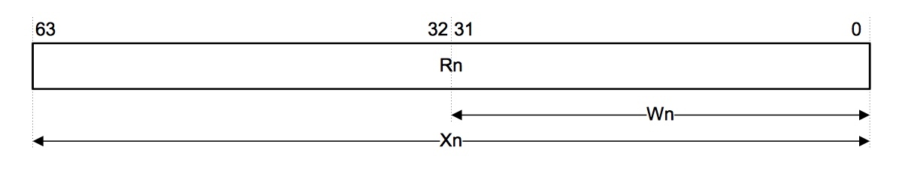
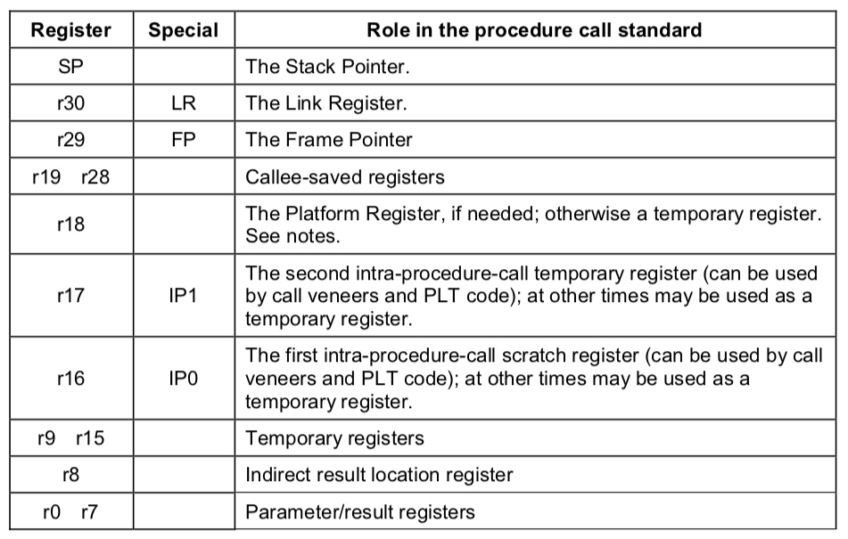
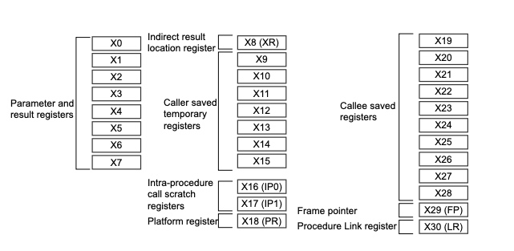

# ARM64 汇编
## 通用寄存器
共有31个64位的通用（整数）寄存器可供A64指令集使用。它们被称为r0-r30.通过w0-w30来访问低32位，x0-x30来访问完整的64位。另外还有一个SP寄存器

对应的用途:

- r0-r7: 参数和返回值(多余参数存在栈上，返回值在r0）
- r8: 非直接结果地址
- r9-r15: 临时寄存器
- r16-r17: 
    X16 and X17 are IP0 and IP1, intra-procedure-call temporary registers.
These can be used by call veneers and similar code, or as temporary
registers for intermediate values between subroutine calls. They are
corruptible by a function. Veneers are small pieces of code which are
automatically inserted by the linker, for example when the branch target is
out of range of the branch instruction.
- r18: 平台寄存器（也可作为临时寄存器）
- r19-r28: 被调用函数保存的寄存器
- r29(FP): 栈帧底部位置
- r30(LR): 最后一次函数调用指令的下一条指令的内存地址（也即是函数返回地址）
- SP/ZR: 栈帧顶部位置/存储

## 特殊寄存器
- PC: 当前执行的指令的地址
- SPRs: SPRs是状态寄存器，用于存放程序运行中一些状态标识。不同于编程语言里面的if else.在汇编中就需要根据状态寄存器中的一些状态来控制分支的执行。状态寄存器又分为 The Current Program Status Register (CPSR) 和 The Saved Program Status Registers (SPSRs)。 一般都是使用CPSR， 当发生异常时， CPSR会存入SPSR。当异常恢复，再拷贝回CPSR.

##栈
栈是从高地址到低地址的， 栈低是高地址，栈顶是低地址。每次函数调用，都会开辟一个栈帧。

##常用简单指令
* mov
* sub
* add
* stp
* ldp

## 参考

[Procedure Call Standard for the ARM 64-bit Architecture](http://infocenter.arm.com/help/topic/com.arm.doc.ihi0055b/IHI0055B_aapcs64.pdf)
[Programmer’s Guide for ARMv8-A](http://infocenter.arm.com/help/topic/com.arm.doc.den0024a/DEN0024A_v8_architecture_PG.pdf) 章节:9.1.1
[arm指令官方文档](http://infocenter.arm.com/help/index.jsp?topic=/com.arm.doc.dui0802a/STP_gen.html)