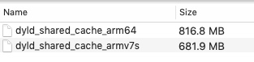
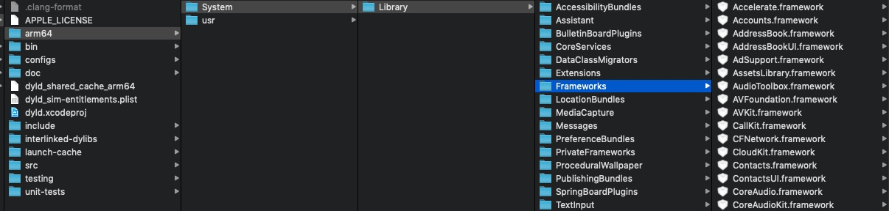
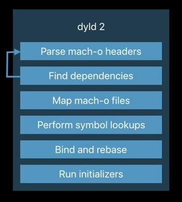
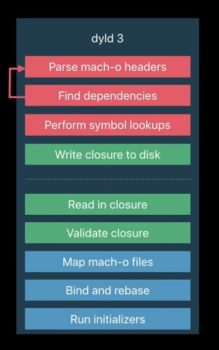

# 程序加载
编写一个应用程序时，我们看到的入口函数都是main.m里面的mian函数，但程序并不是从这里开始的。

## dyld简介
程序运行会依赖很多系统动态库。系统动态库通过动态库加载器（默认是/usr/lib/dyld）加载到内存中，系统内核在做好启动程序的准备工作之后就会将工作交给dyld。为了优化启动速度和利用动态库缓存，iOS系统应用了共享缓存技术。将很多系统库打包到一起，放在/System/Library/Caches/com.apple.dyld/目录下，然后按不同的架构保存了不同的文件。（下图是6s的）

要分析原始的二进制文件，需要从dyld缓存文件中将系统库的原始二进制文件提取出来。方法如下：
1. dsc_extractor

    [下载源码635.2](https://opensource.apple.com/tarballs/dyld/)，解压后删掉launch-cache/dsc_extractor.cpp文件第911行**'#if 0'**及以上内容，再删掉最后的最后一行的**#endif**。使用下面的命令编译生成dsc_extractor文件，再用生成的文件对cache文件解压

    ```
    clang++ -o dsc_extractor dsc_extractor.cpp //生成dsc_extractor

    ./dsc_extractor ../dyld_shared_cache_arm64 ../arm64 //解压
    ```
这样就看到了我们熟悉的各种系统库


2. [jtool](http://www.newosxbook.com/tools/jtool.html)

    ```   
    jtool -e UIKit dyld_shared_cache_arm64
    ```
3. dyld_cache_extract
    mac的界面导出工具[dyld_cache_extract](https://github.com/macmade/dyld_cache_extract)

在新设备连接到Xcode时也会自动提取系统库到~/Library/Developer/Xcode/iOS\ DeviceSupport 目录下（可定期清理）。共享缓存在系统启动后被加载到内存中，当有新程序加载时就会先到共享缓存里面寻找，如果找到，就直接将共享缓存中的地址映射到目标进程的内存地址空间，极大提供了加载效率。
## dyld加载流程
22


