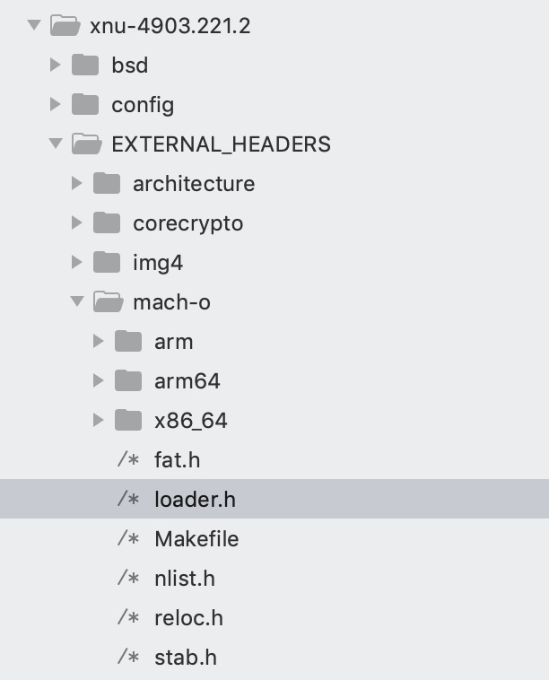
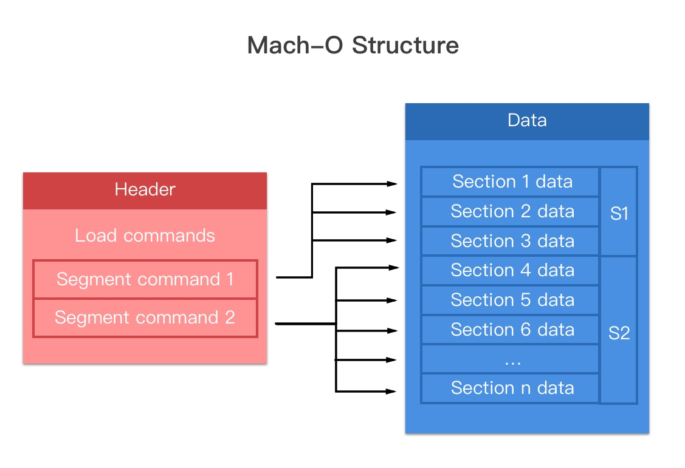

# Mach-O
Mach Object的缩写。
[xnu源码](https://opensource.apple.com/tarballs/xnu/)里有定义Mach-O的种类

常见类型(可用file命令验证）
- MH_OBJECT
    - .o (目标文件）
    - .a (静态库，n个.o合并在一起）
- MH_EXECUTE
    - 可执行文件
- MH_DYLIB
    - .dylib （动态库）
    - .framework
- MH_DYLINKER
    - /usr/lib/dyld
- MH_DSYM
    - 符号文件（分析crash）release产物路径/xx.app.dSYM/Contents/Resources/DWARF/xx
    

##通用二进制文件 Universal binary
包含了多种架构的二进制文件。也称为胖二进制文件
lipo 命令可以用来查看和分拆/合并胖二进制文件
```
//查看二进制文件信息
lipo -info mach-o_file_name
//取出指定架构mach-o
lipo mach-o_file_name -thin armv7 -output mach-o_file_name_armv7
```
##Mach-O文件结构

一个Mach-O文件包含3部分
- Header
    - 文件类型，目标架构，大小端等
- Load commands
    - 描述每个Segment在虚拟内存中的逻辑结构和布局
- Data
    - 原始数据/代码等

在上面文件loader.h中也有Mach-O头和大小端的信息

- magic 标志符 0xfeedface 是 32 位， 0xfeedfacf 是 64 位。
- cputype 和 cpusubtype 确定 cpu 类型、平台
- filetype 文件类型，可执行文件、符号文件（DSYM）、内核扩展等，与上面类型定义对应。
- ncmds 加载 Load Commands 的数量
- flags dyld 加载的标志
    - MH_NOUNDEFS 目标文件没有未定义的符号，
    - MH_DYLDLINK 目标文件是动态链接输入文件，不能被再次静态链接,
    - MH_SPLIT_SEGS 只读 segments 和 可读写 segments 分离，
    - MH_NO_HEAP_EXECUTION 堆内存不可执行…
    - 所有类型也都可以在loader.h中找到

    


##参考
[apple文档](http://www.cs.miami.edu/~burt/learning/Csc521.091/docs/MachOTopics.pdf)
[Mach-O 文件格式探索](https://www.desgard.com/iosre-1/)
[探秘 Mach-O 文件](https://juejin.im/post/5ab47ca1518825611a406a39)
