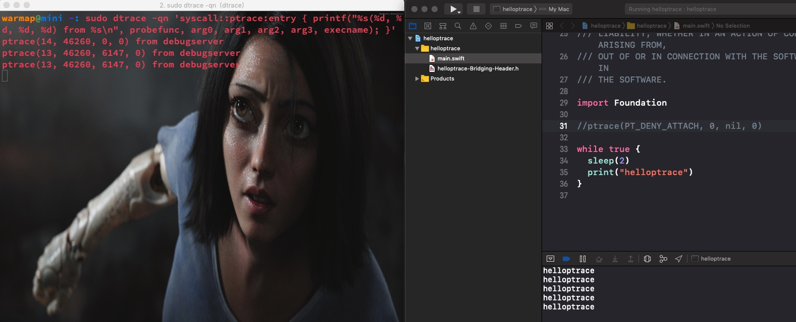
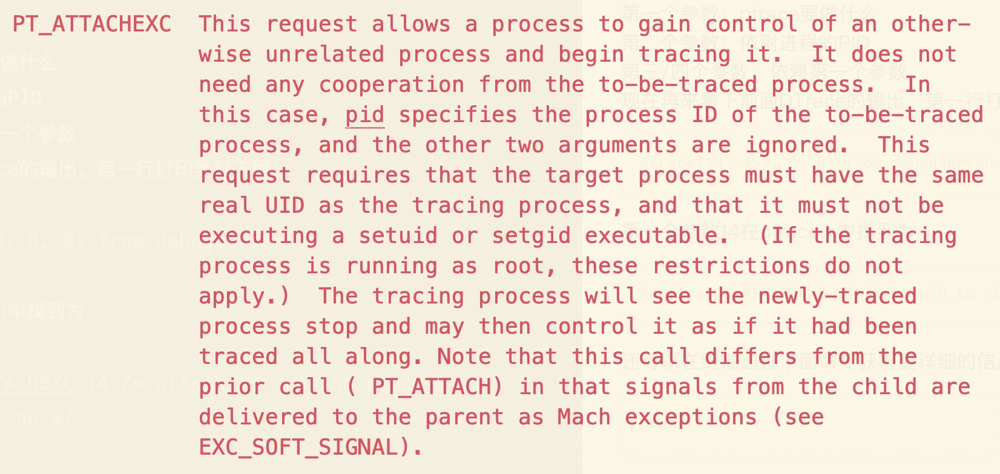
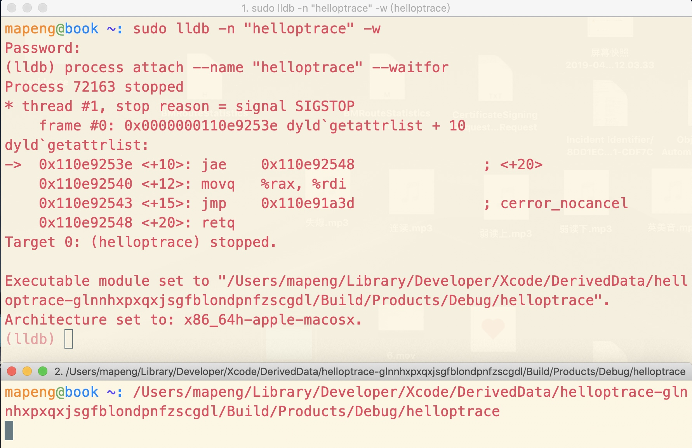

#Hello Ptrace
##系统调用/System calls 
系统调用是内核提供的强大的底层服务。系统调用是开发者接触的frameworks的基石，例如c的stdlib，Cocoa，UIKit以及开发者自建的framework都是建立在这之上。

在终端执行如下命令可以打印出你系统大概的系统调用数
```
sudo dtrace -ln 'syscall:::entry' | wc -l
```
> Note: You’ll need sudo for the DTrace command as DTrace can monitor processes across multiple users, as well as perform some incredibly powerful actions. With great power comes great responsibility — that’s why you need sudo.

##依附的基础-ptrace
在终端执行如下命令，查看ptrace是如何被调用的
```sudo dtrace -qn 'syscall::ptrace:entry { printf("%s(%d, %d, %d, %d) from %s\n", probefunc, arg0, arg1, arg2, arg3, execname); }'```
 上面的命令会创建一个DTrace的检测器，每次有ptrace被执行都会被打印出并带有参数。
 
用**⌘ + T**在终端新建一个tab，键入如下命令：
```
lldb -n Finder
```
当你依附到**_访达_**上时，DTrace的检测器（第一个tab）打印出类似下面的信息
```
ptrace(14, 459, 0, 0) from debugserver
```
看起来是debugserver调用了ptrace并依附到了**_访达_**上，但debugserver是谁调用的？你明明是通过LLDB依附的**_访达_**。还有个问题就是debugserver是否还在运行？
在终端再新建一个tab，我们来解释这些疑问。键入如下命令：
```
pgrep debugserver
```
这会打印出debugserver的PID，表明其正在运行。在通过如下命令查看debugserver如何启动的
```
ps -fp `pgrep -x debugserver`
```
这会打印出完整的debugserver路径，并带有执行的参数。类似：

再键入下面的命令可以打印出调用debugserver的进程的PID
```
ps -o ppid= $(pgrep -x debugserver)
```
在通过下面的命令查看对应进程
```
ps -a 40232
```


这就可以看到是lldb调用了debugserver，并通过ptrace系统调用把自己依附到了**_访达_**上。
##ptrace arguments
通过上面的实践你已经能看到ptrace的调用时机和对应参数。但只是一些数字，下面通过`<sys/ptraced.h>`头文件来看看它具体的含义。

打开本章的**helloptrace**项目，这是一个非常简短的命令行项目。一个桥接文件用来import ptrace的头文件，然后就是main.swift文件了。

在main.swift文件加入如下代码
```
while true {
  sleep(2)
  print("Hello, ptrace")
}
```
在一个桌面摆好xcode和带有DTrace监控器的终端，方便查看。run起项目，带有DTrace监控器的终端会打印类似下面的内容

看下ptrace的头文件
```
int	ptrace(int _request, pid_t _pid, caddr_t _addr, int _data);
```
第一个参数：ptrace要做什么
第二个参数：依附进程的PID
第三/四个参数：依赖第一个参数
现在再来看下前面DTrace的输出。第一行打印类似下面：
    
    ptrace(14, 459, 0, 0) from debugserver
    
第一个参数14在ptrace.h中找到为

    #define PT_ATTACHEXC 14 /* attach to running process with signal exception */
    
还可以在终端通过下面命令获得更详细的信息

    man ptrace

这样这个命令就很清楚了。

再来看DTrace输出中的第二次ptrace调用

    ptrace(13, 50121, 5891, 0) from debugserver
13在ptrace.h文件中找到为

    #define PT_THUPDATE 13 /* signal for thread# */

这个调用和进程依附内部实现有关。可以理解为控制进程（要依附的进程，这个case里也就是debugserver）如何处理发送给被控制进程（被依附的进程，这个case里也就是helloptrace）的UNIX signals和Mach messages

当signal发送给一个被控制进程时，内核需要知道后续如何处理。控制进程可以阻止这些signal发送到被控制进程。

13这个特定的ptrace操作，是Mach核心对ptrace的内部具体实现，无需过多的关注。（在```man ptrace```中也没有说明）

##阻止依附
一个进程可以通过给ptrace传入参数PT_DENY_ATTACH来指明不希望被依附，这就是常用的反调试机制。

打开main.swift，在while循环前加上如下代码

    ptrace(PT_DENY_ATTACH, 0, nil, 0)

build and run，注意debugger控制台的输出。项目会退出并打印出
    
    Program ended with exit code: 45
这是因为Xcode启动helloptrace项目时，默认了LLDB的依附。这样LLDB会退出，且项目会停止运行。
当你先执行了helloptrace的运行，然后延迟依附操作，LLDB的依附还是会失败，但helloptrace不会停止运行。

有很多应用都使用了这种方式反调试，但。。。放句原文感受下
it’s rather trivial to circumvent this security precaution

##PT_DENY_ATTACH
一个进程使用了带有PT_DENY_ATTACH参数的ptrace会增加依附的负责度，但有个简单的方式规避这个问题。

一般```ptrace(PT_DENY_ATTACH, 0, 0, 0)```会被放到main函数中。LLDB有一个```-w```参数可等待进程启动后在进行依附，然后就可对其进行一些操作，包括在ptrace执行PT_DENY_ATTACH前将其忽略掉。

打开终端键入如下命令

    sudo lldb -n "helloptrace" -w
这会启动一个lldb session，而```-w```会使lldb等到有一个新的名为helloptrace进程启动时进行依附。

在Xcode中的找到helloptrace项目的Products文件夹，右击helloptrace的可执行文件，选择```show in Finder```。然后将helloptrace可执行文件拖到终端里，按回车键执行。

在看之前等待helloptrace执行的窗口，发现lldb已经发现新的helloptrace进程启动了，并已经依附上了。在lldb中使用下面的命令来打一个正则断点，停住所有包含ptrace字样的调用。
    
    rb ptrace -s libsystem_kernel.dylib
这样我们就有了一个断在内核ptrace方法的断点了，然后输入```c```继续helloptrace的执行，然后就会命中刚打好的断点，这时我们键入如下命令跳过这个函数执行

    thread return 0
再然后再输入```c```继续运行，这样就跳过了ptrace的执行。这时你会发现执行helloptrace的终端窗口会重复打印“helloptrace”了。也就是成功的完成了简单的反反调试了。
##其他反调试技巧
在很长的一段时间里iTunes都是使用ptrace的PT_DENY_ATTACH来进行反调试，而现在的iTunes版本（12.7.0）更新了反调试技术。

现在iTunes会使用更强大的**sysctl**来检查是否正在被调试，如果是则kill自己的进程。**sysctl**也是一个内核函数就像**ptrace**，它会设置和访问内核的一些值。iTunes会使用NSTimer循环的调用**sysctl**。下面是关于**sysctl**简化的swift版本iTunes代码
```
let mib = UnsafeMutablePointer<Int32>.allocate(capacity: 4)
mib[0] = CTL_KERN
mib[1] = KERN_PROC
mib[2] = KERN_PROC_PID
mib[3] = getpid()

var size: Int = MemoryLayout<kinfo_proc>.size
var info: kinfo_proc? = nil

sysctl(mib, 4, &info, &size, nil, 0)

if (info.unsafelyUnwrapped.kp_proc.p_flag & P_TRACED) > 0 {
  exit(1)
}
```
目前还不会具体讲解这块，后面的章节会有具体的介绍，这里只需知道还有其他方式就好了。