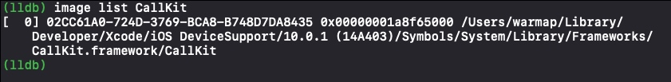
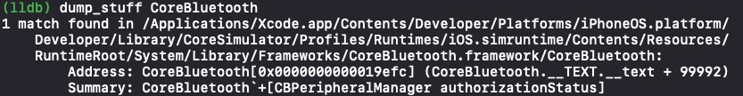

# Dynamic Frameworks
Dynamic Frameworks就是一坨在运行时加到可执行程序中的代码，而不是编译时。例如iOS的UIKit和Foundation frameworks。而这些frameworks就是包含了动态库并可能包含一些资源文件例如图片。

相比静态库使用动态库有很多优势。最明显的就是你可以更新framework而不用重新编译就能生效。

##为什么用动态库
内核可以映射动态库到多个需要这个动态库的进程上。

从iOS8开始，Apple放开动态库的限制，并允许使用第三方的动态库。这最明显的优势就是开发者可以在iOS不同扩展中共用同一个库，例如**Today Extension**和**Action Extensions**。

现在所有Apple平台都允许第三方动态库的使用，而不会在审核时被拒。

动态库带来了另一个角度的学习，调试和逆向工程。因动态库时在运行时加在的，你可以使用LLDB在运行时来浏览和执行代码，这对研究公开或私有库都是非常有帮助的。

##静态调试可执行库
编译可执行程序时，会包含一个动态库的列表（大部分是framework），用来在运行时加载。再细分会有**required framework**和**optional framework**。这些动态库是通过一个特殊的framework - **dynanic loader**（dyld）来加载进内存的。

如果有**required framework**加载失败，**dyld**则会杀掉程序。**optional framework**则不然，当然相关的代码也就不会执行了。

关于**optional framework**，例如当你要使用一个来自比你应用目标版本更高版本的iOS的库时，你就要在运行时检查这个库是否加载了。

光说不练不合适，下面操练一下。

打开Xcode，新建一个名为**DeleteMe**的**Single view Application**，选择Objective-C语言。

在**DeleteMe target**中选择**Build Phases**然后在打开**Link Binary With Libraries**，添加**Social**和**CallKit**，并把**CallKit**置为**Optional**。

在模拟器上build这个项目，先不要run。等成功build后打开**Products**文件夹右击可执行文件show in Finder。通过右击IPA然后**Show Package Contents**打开IPA文件

在这路径打开终端键入如下命令

    otool -L DeleteMe
观察输出下面的输出    

**otool**在编译好的二进制文件DeleteMe中dump出了它需要的动态库的列表，其中编译器帮我们加入了必要的UIKit和Foundation等。

先记下这些动态库的路径，后面还有用。
    
    /System/Library/Frameworks/
    /usr/lib/
我们在深入一点。通过**otool**这个工具我们也能看出我们刚才**CallKit**设置的**Optional**而**Social**设置的**Required**。在终端里，按一下**上**键，把刚才命令中的```L```换成```l```在回车执行,然后CMD+F搜一下**Callkit**， 你会得到下图的结果

你会发现**CallKit**的CMD值为```LC_LOAD_WEAK_DYLIB```也就代表是**optional**的。而**Social**的是```LC_LOAD_DYLIB```也就表明了是**required**。

##修改 load commands
**install_name_tool**可以修改Mach-O文件里的动态库，具体信息可以通过**man install_name_tool**查看

打开Xcode，build and run DeleteMe到手机上，跑起来后通过debugger暂停项目，然后键入下面的命令
    
    image list CallKit
如果输出类似下面，则表示CallKit成功加载了

下面我们看下DeleteMe程序是从哪里run起来的，打开终端键入如下命令

    pgrep -fl DeleteMe
如果DeleteMe正在运行，那这会打印出DeleteMe在模拟器下的完整路径。类似下面

你先在可以修改可执行文件的**load commands**来指向另一framework

停掉Xcode。注意如果你不小心又重新build and run了DeleteMe，那么我们下面要做的tweak就都被复原了。

复制DeleteMe的完整路径,在终端窗口键入如下命令.新建名为app的终端变量
```app=/Users/warmap/Library/Developer/CoreSimulator/Devices/C70BCBEE-6AC7-48CA-BBE7-A3DB4F8A3727/data/Containers/Bundle/Application/7179FEB8-CB15-4DBD-81A0-E9E317A511B3/DeleteMe.app/DeleteMe```
在给CallKit和我们用来替换它的NotificationCenter创建对应的终端变量
```CK=/System/Library/Frameworks/CallKit.framework/CallKit```
```NK=/System/Library/Frameworks/NotificationCenter.framework/NotificationCenter```
然后还在这个终端窗口键入如下命令，来替换这两个framework
```install_name_tool -change "$CK" "$NK" "$app"```
如果你用的是真机的话，这个操作会失败，是因为代码签名的问题。如果你改变了应用，但不重新签名，就会破坏整个应用的签名加密。幸运的是，我们改动的是模拟器的app，并没有这些强制校验，本章最后一节会讨论代码签名。

在用otool查看下
```otool -L "$app"```
如果一切正常的话，你会看到下图的输出。CallKit被NotificationCenter替换了。


下面我们再在运行时验证一下这个改动。注意不要重新run这个项目，这会覆盖我们的改动。应该是在模拟器打开**DeleteMe**应用然后在通过下面的命令把LLDB依附上来查看

    lldb -n DeleteMe
在通过下面命令查看**CallKit**和**NotificationCenter**是否加载了
    
    image list CallKit
    image list NotificationCenter
你会得到下面的输出，证实我们确实替换了**CallKit**为**NotificationCenter**

替换（或者增加）一个已经编译好二进制文件的frameworks看起来很cool，但这个过程还是比较麻烦的。幸运的是，LLDB在运行时加载frameworks到进程中大有可为，不要关掉刚才的lldb终端窗口，下面我们来体验更简洁的方式。
##运行时加载frameworks
在开始前，为了方便在lldb中浏览路径我们将下方的命令添加到**~/.lldbint**文件中
```command regex ls 's/(.+)/po @import Foundation; [[NSFileManager defaultManager] contentsOfDirectoryAtPath:@"%1" error:nil]/'```
上面的代码会在lldb增加一个```ls```命令，可以帮你在lldb中打印被调试设备里文件夹内的内容。当然模拟器就是我们硬盘里的一个路径了，真机的话就是对应应用的沙盒里。 

因为lldb已经在运行了，也就是读过**~/.lldbint**里的内容了，要想上面的**ls**命令生效还要执行下面的命令

    command source ~/.lldbint
这会重加载一下这个文件。
下面我们找一下，framework所在的完整路径，再键入下面的命令

    image list -d UIKit
这会打印出UIKit所在的完整路径

我们要的是UIKit所在的上一级目录，复制这个路径，然后利用我们刚加的**ls**命令，打印出这个路径下的所有frameworks

在列表这些framework中，我们把**Speech** framework加载到DeleteMe中，在lldb中用下面的命令
```process load /Applications/Xcode.app/Contents/Developer/Platforms/iPhoneOS.platform/Developer/Library/CoreSimulator/Profiles/Runtimes/iOS.simruntime/Contents/Resources/RuntimeRoot/System/Library/Frameworks/Speech.framework/Speech```
成功输入如下。

更cool的是，默认情况下，dyld会检索多个文件目录来找到需要的framework，你并不需要制定一个唯一的目录，只需要名字就好了。下面演示一下添加**MessagesUI** framework

    process load MessageUI.framework/MessageUI
你会得到下面的成功提示

##探索 frameworks
逆向的基础工作之一就是探索动态库，因为动态库的代码需要被编译为位置无关的可执行文件，所以你还是可以在动态库中获取很多信息，即使编译器把动态库的符号表剥离了。二进制文件需要使用**位置无关**的代码，因为当dyld完成它的任务时，编译器也不知道代码被重定位到内存哪里了。

如果你有扎实的基础理解应用是如何与framework交互的，那么你能更清楚的明白应用是如何工作的。例如，有一个砸壳的应用，它使用了UITableView，那么我会在UIKit中相关的方法打上断点来查看谁是它的UITableViewDataSource。

平时我研究一个动态库时，我会把它加载到一个应用中，然后进行一系列的image lookup检查（或使用我自定义的[lookup](https://github.com/DerekSelander/lldb)命令）来看它都有哪些模块/功能。

开始下一步操作前，还是先添加个LLDB的正则命令（注意重新加载.lldbinit)
```command regex dump_stuff "s/(.+)/image lookup -rn '\+\[\w+(\(\w+\))?\ \w+\]$' %1 /"```
这个**dump_stuff**命令，入参为一个或多个framework，会打印出对应framework里没有入参的Objective-C类方法，虽然没有打印更多信息，但是个适合快速探索的命令。

下面是查看CoreBuletooth的输出


然后把下面几个命令都加上

这个会打印出一个对象所有的ivar

    command regex ivars 's/(.+)/expression -lobjc -O -- [%1 _ivarDescription]/'
这个会dump出本类所有的方法

    command regex methods 's/(.+)/expression -lobjc -O -- [%1 _shortMethodDescription]/'
这个会遍历dump出本类及父类以上所有的方法

    command regex lmethods 's/(.+)/expression -lobjc -O -- [%1 _methodDescription]/'
以上命令对加载、浏览和检索framework内容都非常有帮助。例如你想看UIPhotos framework的内容，先输入下面内容
    
    (lldb) process load PhotosUI.framework/PhotosUI
然后可以看看无参的类方法
    
    (lldb) dump_stuff PhotosUI
可以看下PUScrubberSetting对象的ivars

```
(lldb) ivars [PUScrubberSettings sharedInstance]
<PUScrubberSettings: 0x7fc478501850>:
in PUScrubberSettings:
	_usePreviewScrubberMargins (BOOL): NO
	_useTrianglePositionIndicator (BOOL): NO
	_useSmoothingAnimation (BOOL): NO
	_dynamicSeekTolerance (BOOL): YES
	_previewInteractiveLoupeBehavior (unsigned long): 2
	_interactiveLoupeBehavior (unsigned long): 0
	_tapAnimationDuration (double): 0.5
	_smoothingAnimationDuration (double): 0.05
	_settleAnimationDuration (double): 0.75
	...
```
也可以看看对象的方法
```
(lldb) methods PUScrubberSettings
<PUScrubberSettings: 0x124b4ed78>:
in PUScrubberSettings:
	Class Methods:
		+ (id) sharedInstance; (0x1248af5c7)
		+ (id) settingsControllerModule; (0x1248af884)
	Properties:
		@property (nonatomic) unsigned long previewInteractiveLoupeBehavior;  (@synthesize previewInteractiveLoupeBehavior = _previewInteractiveLoupeBehavior;)
		@property (nonatomic) BOOL usePreviewScrubberMargins;  (@synthesize usePreviewScrubberMargins = _usePreviewScrubberMargins;)
...
```
甚至打印包含父类所有的方法

    (lldb) lmethods PUScrubberSettings
> Note: 目前只探索了公共framework目录**System/Library/Framework**的framework，读者可以尝试下**System/Library**下的，例如**System/Library/PrivateFrameworks
##加载framework到真机上
如果你有可用的开发者账号，一个写好的项目和一台iPhone，那么你可以把刚才在模拟器上的操作在真机上再来一遍。其中**System/Library**位置会有些不同

如果是模拟器的话，公开库目录在
`/Applications/Xcode.app/Contents/Developer/Platforms/
iPhoneSimulator.platform/Developer/SDKs/iPhoneSimulator.sdk/
System/Library/Frameworks/`
但刚才模拟器上otool -L打印出的剧对路径是**System/Library/Frameworks**，这是为什么呢？dyld会到指定的目录下查找这些framework，而对应的模拟器有个dyld_sim，它会在模拟器上面的位置找framework。
所以在真机上时，还是下面的这个位置
`/System/Library/Frameworks/`
有些同学可能想到了沙盒机制，iOS内核对不同的目录是有不同限制的，在iOS12和之前，**/System/Library/**是可以被你的进程访问的。这也说的过去，因为你的程序肯定是要用到公有或私有的framework的嘛，如果因为沙盒机制禁止了你读这些路径，应用都不能运行了。

我们是一下，在真机上跑一个项目，然后lldb中键入`ls /`,再试一下`ls /System/Library`一些目录会加载失败，这是因为内核不允许。但还是能打印出一部分目录。

你已经具备加载framewrok到应用里并探索它内容的能力，**/System/Library**还有很多有意思的framework在它的子目录下。鼓励大家去探索一番。