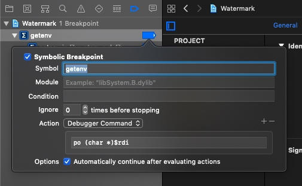
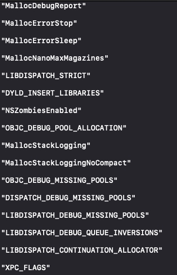
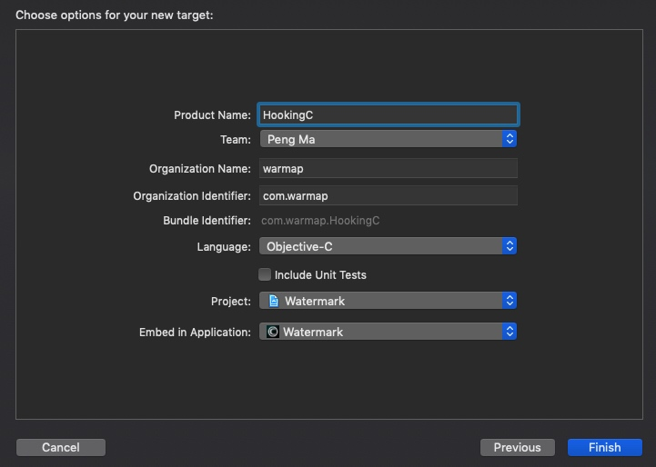
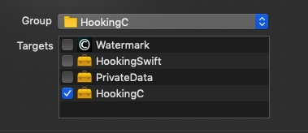
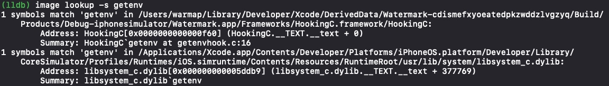
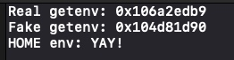
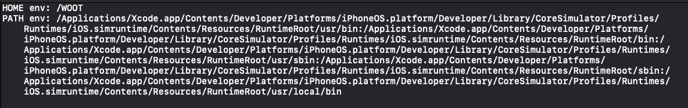

# 用dlopen&dlsym来hook和执行代码
LLDB在设置断点和探究一些类时，非常的好用。一些正常情况下没有能力的操作

本章将会讲一些hook Swift和C的代码的方法和策略以及执行一些平时你没有权限的方法。这些技巧当你工作涉及私有库，并想执行里面的方法或改变对应实现时非常的重要。这个过程你将需要**dlopen**和**dlsym**

##The Objective-C runtime vs Swift & C
归功于强大的runtime，Objective-C是一门动态语言。在编译甚至运行时，应用都不能确定下一次objc_msgSend会发生什么。

有几种策略来hook OC的方法，后面的章节都会讲到。本章主要讲如何在Swift下hook和执行framework的方法

Swift执行很像C或C++。如果不需要OC的动态分发，那么编译器就不会这么处理。也就意味着你看swift方法的汇编，它没有动态分发，汇编会直接调用方法的地址。这时**dlopen**和**dlsym**就能派上用场了。本章就会讲这部分内容。

##搭建好项目
打开starter目录的Watermark项目。这个项目就是单纯展示了一个带水印的图片。而这个图片有些特殊，它以字节数组的形式编译到了项目中。也就是说，这个展示的图片不是以一张我们常见图片的形式打包到应用中，而是这个图片就编码到了可执行文件里。显然是作者不想暴露出这张图片，因为一般逆向工程都会到**Assets.car**中找这些图片资源。而作者把这个图片的数据存到了可执行程序的_TEXT段，而这块会被苹果加密当你发布应用到app store时。如果你对_TEXT段陌生，下一章“hello Mach-O”会讲到。

首先，我们hook一个常用的C函数。基于你理解了相关的概念，我们下面会通过**dlopen**和**dlsym**执行一个你本在编译器的限制下不能执行的私有Swift方法，且不对它所属的framework做任何改动。

##hook C 函数
在学习如何使用**dlopen**和**dlsym**时，我们会关注一个**getenv**的C函数。这个函数接受一个char *的入参，然后返回对应的环境变量。

这个函数会在你应用启动时调用多次。

在Xcode中打开**Watermark**项目，添加一个getenv的符号断点，然后添加`po (char *)$rdi` action，然后打开断点后自动继续执行。

最好，在模拟器上build and run。你会看到类似下方的输出。（只截取了部分）


>note:打印环境变量更优雅的姿势是，把DYLD_PRINT_ENV添加到环境变量，不添加value。这会在运行时打印出所有的环境变量

需要指出的是这些打印都是在main函数之前的。这样意味着你可以在你的程序执行前去更改这些调用。

由于C没有动态分发，所以hook需要在它加载之前进行。而且C函数找到，只需要函数所处的动态库名称和函数名称。

鉴于C的全能，且几乎所有地方有都用到，我们有几种不同的策略来hook C函数。如果要hook你自己应用中的C函数还是比较容易的。但要hook一个dyld加载的C函数（也就是你代码执行前）难度要上升一个档次的。

当你的main开始执行时，load commands指定的动态库都已经import了。正如前面章节所学，动态链接器会以深度优先的遍历方式来加载。一个库在加载，由dyld来决定是立即加载还是懒加载。通常来说，大部分都是懒加载的，除非你指明特殊的linder flags

懒加载函数，是在第一次被调用的时候，通过dyld的操作找到对应的module和函数地址。然后把这个地址放到内存中特定的段（__DATA.__la_symbol_ptr,后面会说到）。一旦完成了地址的查找，后续的调用就不需要dyld了。

这意味着你要hook应用执行前的函数，你需要创建一个动态库来存储你的hook逻辑。这样就能在你的main函数前被调用了。----我们先从简单的case开始，在应用内hook C函数。

把application(_:didFinishLaunchingWithOptions:) 替换为如下实现
`
func application(_ application: UIApplication, didFinishLaunchingWithOptions launchOptions: [UIApplication.LaunchOptionsKey : Any]? = nil) -> Bool {
  if let cString = getenv("HOME") {
    let homeEnv = String(cString: cString)
    print("HOME env: \(homeEnv)")
  }
  return true
}
`
这是通过调用getenv来获得在打印出HOME环境变量

下面，关闭getenv的符号断点，build and run，你会得到如下的输出
`HOME env: /Users/warmap/Library/Developer/CoreSimulator/Devices/5F1726B5-9D95-40E0-8B20-47383518E30F/data/Containers/Data/Application/8178E14D-DA69-4B17-A6A1-5A34F1A34388`
这是模拟器下的HOME环境变量。

我们来hook一下getenv函数，当入参为HOME时，做些改变

正如前面所说，你需要创建一个framework，在应用解析出getenv地址之前，来获取getenv的地址，并作出改动。

打开Xcode，定位到**File ▸ New ▸ Target** 然后选择**Cocoa Touch Framework**命名为**HookingC**选择**Objective-C**语言

然后在HookingC目录下新建C文件，命名为**getenvhook**不要创建头文件

然后确定文件属于**HookingC** framework

打开**getenvhook.c**，输入下面内容
```
#import <dlfcn.h>
#import <assert.h>
#import <stdio.h>
#import <dispatch/dispatch.h>
#import <string.h>
```
- dlfcn.h是dlopen和dlsym的头文件
- assert.h用来测试包含getenv的库是否被正确加载
- stdio.h用来调用printf
- dispatch.h用来调用diapatch_once函数
- string.h用来调用strcmp函数
下面重定义getenv函数，并硬编码为如下
```
char * getenv(const char *name) {
  return "YAY!";
}
```
build and run你会发现打印变成了
```
HOME env: YAY!
```
Awesome！你已经成功的用自己的实现替换掉了这个方法。但这不完全是你想要的，因为我们只想替换掉入参为HOME时的实现。

我们试着把代码给成下面的样子
```
char * getenv(const char *name) {
  return getenv(name);    
  return "YAY!";
}
```
你会发现程序跑起来就crash了。是因为之前的getenv被你的实现替换了，上面的代码会循环调用你自己实现的getenv，最终栈溢出了。

撤回上面的加的那一行代码，我们需要另一种策略来获取getenv的原实现。

首先，需要知道的是getenv是属于那个库。打开Xcode重新run刚才的项目，跑起来后暂停运行，然后lldb键入如下命令

    (lldb) image lookup -s getenv
你会得到类似下面的输出    
第一个是我们刚写的getenv，第二个就是我们想要。完整路径是`/usr/lib/system/libsystem_c.dylib`因为是模拟器所以路径还有前面的一大串。现在我们有了getenv的完整地址，下面是dlopen派上用场的时候了。dlopen的方法签名类似下面
```
extern void * dlopen(const char * __path, int __mode);
```
dlopen第一个入参为一个完整路径，第二个入参为int值，标明dlopen如何加载第一个参数传入的module。如果成功会返回void *如果失败则返回NULL

当dlopen返回了module的引用，我们需要使用dlsym来获得getenv的引用。dlsym的方法签名如下
```
extern void * dlsym(void * __handle, const char * __symbol);
```
dlsym第一个入参为dlopen的返回，然后方法名为第二个入参。如果正常，dlsym会返回方法的地址，否则返回NULL。

将getenv实现改成如下所示
```
char * getenv(const char *name) {
  void *handle = dlopen("/usr/lib/system/libsystem_c.dylib",
                         RTLD_NOW);
  assert(handle);
  void *real_getenv = dlsym(handle, "getenv");
  printf("Real getenv: %p\nFake getenv: %p\n",
         real_getenv,
         getenv);
  return "YAY!";
}
```
运行，你会得到下面的输出

下面，我们用函数指针real_getenv来接受dlsym返回的原getenv函数指针，并把我们想要的逻辑补充完整，如下所示(需要点C基础）
```
char * getenv(const char *name) {
  static void *handle;      // 1
  static char * (*real_getenv)(const char *); // 2
  
  static dispatch_once_t onceToken;
  dispatch_once(&onceToken, ^{  // 3
    handle = dlopen("/usr/lib/system/libsystem_c.dylib",
                    RTLD_NOW);
    assert(handle);
    real_getenv = dlsym(handle, "getenv");
  });
  
  if (strcmp(name, "HOME") == 0) { // 4
    return "/WOOT";
  }
  
  return real_getenv(name); // 5
}
```
现在打开AppDelegate.swift，然后替换application(_:didFinishLaunchingWithOptions:)的实现为：
```
func application(_ application: UIApplication,
                 didFinishLaunchingWithOptions launchOptions: [UIApplication.LaunchOptionsKey : Any]? = nil) -> Bool {
  if let cString = getenv("HOME") {
    let homeEnv = String(cString: cString)
    print("HOME env: \(homeEnv)")
  }
  
  if let cString = getenv("PATH") {
    let homeEnv = String(cString: cString)
    print("PATH env: \(homeEnv)")
  }
  return true
}
```
运行程序你会得到如下输出

也证明了我们的需求得到了实现。

还有个点需要注意下，当你调用了UIKit的函数，而UIKit又调用了getenv，那么你实现的getenv就不会被调到了。因为getenv的地址已经在UIKit代码加载时被处理出来了。

为了在UIkit也能调到我们的getenv实现，你需要**indirect symbol table**和修改getenv在__DATA.__la_symbol_ptr段内地址的知识。这些后面章节会讲到。

##hook Swift 方法
hook swift的非动态分发代码和hook C非常像，但有几个点使得hook swift方法还是更难一些。

swift还是留到后面翻译