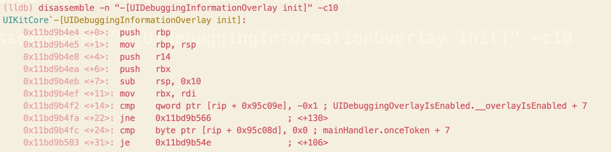
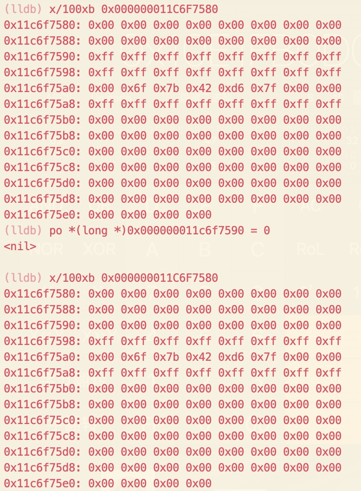

# Method Swizzling Objective-C Frameworks
在前两章讲到了动态加载和dlopen与dlsym的使用。现在只要你知道了函数的名字，即使编译器隐藏这个函数对你也是无用的。

我们会利用oc runtime来hook和执行你感兴趣的方法，这就是我们对动态库探索的终章了。

本章我们会探索几个UIKit的私有类，它们对可视化调试很有帮助。首当其冲的就是**UIDebuggingInformationOverlay**，它由iOS9加入的，并因为ryanipete的[一篇文章](http://ryanipete.com/blog/ios/swift/objective-c/uidebugginginformationoverlay/)而广为人知。

不幸的是，在iOS11，苹果发现了开发者在使用这个私有类，并加了一些检查措施来保证只有使用了UIKit的内用应用才能访问这些私有的调试类。至于iOS12，苹果并没有增加更多的检查，但这些逻辑从UIKit移到了UIKitCore中，（可能是）因为WWDC2018说要整合macOS和iOS。

你将探索**UIDebuggingInformationOverlay**这个类，并学习为什么这个类在iOS11及以上不再生效，还有苹果强制加的这些检查（通过lldb先写到特定的内存区域）。然后你会学到几种通过OC的method swizzling来使用**UIDebuggingInformationOverlay**的方式。

我强烈要求你使用iOS12设备，来学习本章内容。因为苹果可能会对这些私有类推行新的检查机制而本章并没有介绍到。

##iOS10 和 iOS12
在iOS9和10中，显示这个overlay还是很容易的，只需要在lldb中执行下面的命令
```
(lldb) po [UIDebuggingInformationOverlay prepareDebuggingOverlay]
(lldb) po [[UIDebuggingInformationOverlay overlay] toggleVisibility]
```
如果你有iOS10的模拟器，推荐你还是打开一个项目跑一下试试看。

不幸的是，iOS12做了改变，上面的命令并不会生效。为了理解发生了什么，你需要探索**UIDebuggingInformationOverlay**重写的方法，并涉及到汇编语言。

用lldb依附到任一iOS12模拟器的进程，我们将探索UIKitCore module的汇编实现。

例如，打开模拟器的照片应用，然后在终端中敲入如下命令

    (lldb) lldb -n MobileSlideShow
当你依附到了iOS模拟器的进程，用LLDB查找**UIDebuggingInformationOverlay**重写的方法

    (lldb) image lookup -rn UIDebuggingInformationOverlay
或者用**methods**命令，你在“Dynamic Frameworks”这一章创建的。
    
    (lldb) methods UIDebuggingInformationOverlay
如果你跳过了这一章，用下面的命令也是一样的
    
    (lldb) exp -lobjc -O -- [UIDebuggingInformationOverlay _shortMethodDescription]
记下被重写的init方法

我们将探索这些init方法干了什么。你可以继续使用lldb的反汇编命令，但为了更好的可视效果，我会使用我（作者）自定义的lldb反汇编程序--**dd**。它的打印是有高亮的。你可以到这个[地址](https://github.com/DerekSelander/LLDB/blob/master/lldb_commands/disassemble.py)来取。

lldb展示init的汇编代码的命令如下：（黑白的哦）

    (lldb) disassemble -n "-[UIDebuggingInformationOverlay init]"
用**dd**的效果如下

这是iOS10版本的。

把上面翻译成为OC代码为：
```
@implementation UIDebuggingInformationOverlay

- (instancetype)init {
  if (self = [super init]) {
    [self _setWindowControlsStatusBarOrientation:NO];
  }
  return self;
}

@end
```
我们再来看下iOS12的版本

我们大致的翻译为
```
@implementation UIDebuggingInformationOverlay

- (instancetype)init {
  static BOOL overlayEnabled = NO;
  static dispatch_once_t onceToken;
  dispatch_once(&onceToken, ^{
    overlayEnabled = UIDebuggingOverlayIsEnabled();
  });
  if (!overlayEnabled) { 
    return nil;
  }

  if (self = [super init]) {
    [self _setWindowControlsStatusBarOrientation:NO];
  }
  return self;
}

@end
```

这里利用**UIDebuggingOverlayIsEnabled()**在iOS11及以上版本，增加了是否为内部Apple设备的检查，不是则返回nil。

你可以在iOS12中键入如下命令来验证这些

通过下面的命令我们来看看init方法的前10行汇编代码
    
    disassemble -n "-[UIDebuggingInformationOverlay init]" -c10

仔细看下偏移14和22（第7/8行）

多亏了苹果在他们的framework中引入了DWARF调试信息，使我们能看到访问的内存地址对应的符号。

记录下**UIDebuggingOverlayIsEnabled.__overlayIsEnabled + 7**这句注释。实际上我觉得这种注释很不爽，感觉更像一个bug。lldb没有显示地址对应的正确符号，而是上一个注释的值+7.而**UIDebuggingOverlayIsEnabled.__overlayIsEnabled + 7**就是我们要的值，但注释没有太大的帮助，因为它是错误的符号。这也是为什么我经常使用我自己的**dd**命令而不是LLDB的。

忽略LLDB注释中错误的符号名，这个地址和-1（也就是64位处理器的0xffffffffffffffff）进行了比较，如果不相等则跳到一个指定地址。再来看**dispatch_once_t**变量，初始值为0，并会在**dispatch_once** block执行完置为-1。

目前可知第一次检查，是**dispatch_once** block是否该执行。如果你想跳过block的执行，那么你可以在内存中把这个值改为-1.

在看上面的汇编，我们有两种方式可以获得我们感兴趣的内存地址。

第一种，你可以算出RIP与偏移的和，也就是`[rip + 0x95c09e]`.注意下PC（program counter）增加后RIP寄存器会保存下一条汇编指令的地址，并执行当前指令。

也就是`[rip + 0x95c09e]`会被解析成[0x11bd9b4fa + 0x95c09e]，算出来就是**0x000000011C6F7598**，这块地址决定了overlay是否初始化。

另一种方式，用lldb的image lookup命令带verbose和symbol选项来查看一下UIDebuggingOverlayIsEnabled.__overlayIsEnabled的地址。

        (lldb) image lookup -vs UIDebuggingOverlayIsEnabled.__overlayIsEnabled

在输出中，注意下range字段的结束地址。这还是因为lldb没有给我们正确的符号。

可以看出我们感兴趣的内容就在**0x000000011C6F7598**了。我们来看下这块地址对应的实际符号是什么。

    (lldb) image lookup -a 0x000000011C6F7598

可以看到UIDebuggingOverlayIsEnabled.onceToken是我们真正要关注的符号。

##改内存跳过检查
我们知道了具体被判断的BOOL值所处内存地址，我们来看下这个值

    x/gx 0x000000011C6F7598
这会以16进制形式打印出在**0x000000011C6F7598**的8字节内容，如果你执行过po [UIDebuggingInformationOverlay new]命令，会输出-1，没执行过的话，会打印出0.(我们先前是执行过的）

我们通过下面的命令改一下

    mem write 0x000000011C6F7598 0xffffffffffffffff -s 8
-s选项指明了，我们要写几个字节。如果敲16个f你觉得效率低，也可以使用下面的命令

    po *(long *)0x000000011C6F7590 = -1
注意这个命令用的低地址，上个命令用的高地址。你可以通过刚才的读取命令确认下更改成功了。

##your turn
我刚展示了如何破掉初始化的检查UIDebuggingOverlayIsEnabled.onceToken，来让dispatch_once block以为已经执行过了。但还有一个检查。
我们重新运行一下刚才的看看汇编命令

    disassemble -n "-[UIDebuggingInformationOverlay init]" -c10
然后关注最后两行。

这个 mainHandler.onceToken 还是**错误的符号**。你实际需要的符号的内存地址是紧跟在这个符号地址后面的。我们在做一遍刚才对UIDebuggingOverlayIsEnabled.__overlayIsEnabled做的操作，来得到实际的符号。经过操作你会发现UIDebuggingOverlayIsEnabled.__overlayIsEnabled就是正确的符号。下面我们来改下这个地址的为-1，因为上面两条汇编表明当值为0时，会跳过执行。
##验证前面的改动
前面我们做了两处改动，下面我们来看看是否能绕过对应的检查了。lldb键入如下命令

可以看到已经成功创建了UIDebuggingInformationOverlay实例，我们再来看下类方法**overlay**是否会返回实例

如上对所示，也返回了可用实例。现在我们把它放到屏幕上，在lldb键入

    (lldb) po [[UIDebuggingInformationOverlay overlay] toggleVisibility]
然后，继续运行项目

    (lldb) continue
已经能看到调试窗口了，但是是空白的。


##横向检查prepareDebuggingOverlay
之所以UIDebuggingInformationOverlay是空白的，是因为没有调用类方法+[UIDebuggingInformationOverlay prepareDebuggingOverlay]。

dump出这个方法的汇编指令，我们可以看到只有一个check需要关心

offset14，19，21.调用了一个名为_UIGetDebuggingOverlayEnabled，检测了AL（RAX寄存器的第一个字节）是否为0.如果是的话，就跳到函数的结尾。也就是说_UIGetDebuggingOverlayEnabled的返回值决定了是否执行这个函数的逻辑。

我们在这个函数上打个断点，直接跳过执行。然后在执行offset19前把AL值改为非零。

先通过下面命令下个断点
    
    b _UIGetDebuggingOverlayEnabled
lldb会提示成功下了断点。然后通过下面命令执行
[UIDebuggingInformationOverlay prepareDebuggingOverlay]

    exp -i0 -O -- [UIDebuggingInformationOverlay prepareDebuggingOverlay]
-i选项用于说明是否要忽略断点，这里0指明了不要忽略任何断点。顺利的话会在调用_UIGetDebuggingOverlayEnabled时命中断点。

我们用下面跳过_UIGetDebuggingOverlayEnabled的执行

    (lldb) finish
控制流会结束_UIGetDebuggingOverlayEnabled的执行从而回到prepareDebuggingOverlay方法，也就是offset19的test AL寄存器前。
我们通过下面命令看下AL寄存器的值：

    (lldb) p/x $al
你会得到0x00
我们改变一下这个值为0xff

    (lldb) po $al = 0xff
我们通过单步执行，来验证一下是否生效了。

    (lldb) si
然后会执行到下面这行命令

    je     0x11fafa6d6               ; <+286>
如果执行test的时候AL的值为0x0，那么这行命令后会跳到offset286处的命令。如果不是，命令会继续执行下去，而不会命中条件跳转指令。

我们在单步执行一次来确定成功了
    
    (lldb) si
现在我们来到了offset27，说明成功了。如果你不是，那么就要重新操作一遍了。

在lldb中，通过下面命令继续程序的运行

    (lldb) continue
想知道[UIDebuggingInformationOverlay prepareDebuggingOverlay]的具体逻辑？
这里有一份大概的翻译版本
```
+ (void)prepareDebuggingOverlay {
  if (_UIGetDebuggingOverlayEnabled()) {
    id handler = [UIDebuggingInformationOverlayInvokeGestureHandler mainHandler];
    UITapGestureRecognizer *tapGesture = [[UITapGestureRecognizer alloc] initWithTarget:handler action:@selector(_handleActivationGesture:)];
    [tapGesture setNumberOfTouchesRequired:2];
    [tapGesture setNumberOfTapsRequired:1];
    [tapGesture setDelegate:handler];
    
    UIView *statusBarWindow = [UIApp statusBarWindow];
    [statusBarWindow addGestureRecognizer:tapGesture];
  }
}
```
有意思的是，这段逻辑是处理了一个在状态栏上的双指触控，在发生时会调用[UIDebuggingInformationOverlayInvokeGestureHandler mainHandler]返回单例的_handleActivationGesture:方法。

我们再来看下这个方法的汇编实现

UITapGestureRecognizer实例通过RDI寄存器传到方法内（Assembly Register Calling Convention这一章有讲到），我们在offset30处看到rax（也就是state）在和0x3比较，如果相等则继续执行，如果不等则跳到函数末尾。

我们看下UIGestureRecognizer的头文件，可以知道state有以下值可取

```
typedef NS_ENUM(NSInteger, UIGestureRecognizerState) {
    UIGestureRecognizerStatePossible,
    UIGestureRecognizerStateBegan,    
    UIGestureRecognizerStateChanged,   
    UIGestureRecognizerStateEnded,      
    UIGestureRecognizerStateCancelled,  
    UIGestureRecognizerStateFailed,     
    UIGestureRecognizerStateRecognized = UIGestureRecognizerStateEnded 
};
```
我们可以得出如果state的值为**UIGestureRecognizerStateEnded**，那么函数的代码就会被执行到。这也就意味着，为了限制开发者的使用，苹果不仅在UIKit中做了检查限制**UIDebuggingInformationOverlay**的使用，还偷偷在状态栏加了一个双指点击的事件。

##概括下
在我们进一步尝试前，我们先快速总结一下，以防你重头来过。

你在内存中找到**UIDebuggingOverlayIsEnabled.onceToken**的地址
```
(lldb) image lookup -vs UIDebuggingOverlayIsEnabled.onceToken
```
然后通过LLDB把它的值改为-1

    mem write 0x000000011C6F7598 0xffffffffffffffff -s 8
    或
    po *(long *)0x000000011C6F7590 = -1
同样对**UIDebuggingOverlayIsEnabled.__overlayIsEnabled**在做一遍改为-1的操作。

然后在**_UIGetDebuggingOverlayEnabled()**打一个断点，并执行**+[UIDebuggingInformationOverlay prepareDebuggingOverlay]**方法然后改变了_UIGetDebuggingOverlayEnabled()方法的返回，最后继续执行。

总之，绕过苹果的检查是有很多种方式的。
##继续
鉴于我们用的模拟器，我们需要按住键盘的**option**键来模拟双击，当两个点击平行时，在按住**Shift**键，然后向上平移触控点到状态栏（注意头帘）并点击


这时就有了全功能的UIDebuggingInformationOverlay了！

##method swizzling
回想下，这一套操作下来我们用了多久？而且每次UIKit加载到进程里，我们都要通过LLDB操作一遍，查找和设置关键内存值可以通过自定义LLDB脚本来执行，但我们还有一个更高效的方式--**method swizzling**.

在进一步研究前，我们先了解一下
method swizzling是在runtime动态替换OC方法的过程。被编译好存在**__TEXT**段的代码是不能够被修改的（有了苹果的合适的entitlements也能改，但苹果不会给你）

当执行OC代码时，objc_msgSend就开始表演了（11章Assembly Register Calling Convention有讲）。objc_msgSend接受一个实例（或类），一个Selector，还有一堆参数然后跳到对应方法的实现。

Method swizzling有很多用途，最常用的就是改变入参或者返回值。它可以检测到一个方法的调用并不需要到汇编形式里查找该方法（我们前面的实验，就是到汇编形式下查找并改变对应的逻辑）。实际上苹果在底层代码上也有应用，例如KVO。

鉴于网上有很多method swizzling相关的文章，这里就不重头开始讲了。（如果你想要的话，我推荐[nshipster](https://nshipster.com/method-swizzling/))

我们从一个简单的例子开始，然后快速进入到应用层面，做一个还没见过别人用Method swizzling做过的事--跳到方法内的一定偏移处屏蔽掉所有不想要的检查。

##进入demo
本章有个非常简单的样例项目-**Overlay**，只有一个UIButton用来触发展示UIDebuggingInformationOverlay。

build and run，点击按钮，你会发现调试控制台输出了

```
UIDebuggingInformationOverlay 'overlay' method returned nil
```
我们已经知道，这是因为还没有处理UIDebuggingInformationOverlay的init方法

打开**NSObject+UIDebuggingInformationOverlayInjector.m**文件，然后定位到**pragma**标记的Section 1。然后加入下面的代码
```
@interface FakeWindowClass : UIWindow
@end

@implementation FakeWindowClass

- (instancetype)initSwizzled
{
  if (self= [super init]) {
    [self _setWindowControlsStatusBarOrientation:NO];
  }
  return self;
}

@end
```
我们声明了一个父类为UIWindow的FakeWindowClass类，因为_setWindowControlsStatusBarOrientation是私有方法所以编译不过。

现在定位到section 0，我们声明下这个方法。

```
@interface NSObject()
- (void)_setWindowControlsStatusBarOrientation:(BOOL)orientation;
@end
```
这样就能编译过了。UIDebuggingInformationOverlay的init方法还是会返回nil，鉴于init方法很简单，我们的方案就是覆盖一下这个方法，并把对应的检查都去掉。

现在把下面的代码添加到section 2覆盖掉之前的load方法，用来把UIDebuggingInformationOverlay的init换成FakeWindowClass的initSwizzled。

```
+ (void)load
{
  static dispatch_once_t onceToken;
  dispatch_once(&onceToken, ^{
    Class cls = NSClassFromString(@"UIDebuggingInformationOverlay");
    NSAssert(cls, @"DBG Class is nil?");
    
    // Swizzle code here
    
    [FakeWindowClass swizzleOriginalSelector:@selector(init)
                         withSizzledSelector:@selector(initSwizzled)
                                    forClass:cls
                               isClassMethod:NO];
  });
}
```
重跑一下项目，然后点击按钮你会发现成功创建了UIDebuggingInformationOverlay实例，并弹出到了窗口上（译者：其实并没有弹到窗口上，但确实创建了UIDebuggingInformationOverlay实例，但hidden属性是yes。本章前面也可以看到弹出来是因为还调用了一个toggleVisibility方法，而且截图能看到hidden=YES。我们自己lldb调用下这个方法，这并不重要）


##最终步骤
我们来处理一下prepareDebuggingOverlay方法，根据前面我们知道prepareDebuggingOverlay会在代码的开头检查下_UIGetDebuggingOverlayEnabled()的返回值是0x0还是0x1，如果是0x0则跳到方法的末尾。

为了规避这个逻辑，我们会通过压一个返回地址到栈上来“模拟”一个**call**指令，但实际上我们会**jmp**一定偏移来跳过_UIGetDebuggingOverlayEnabled的check。这样，我们就可以继续执行函数除_UIGetDebuggingOverlayEnabled检查以外的逻辑了

在**NSObject+UIDebuggingInformationOverlayInjector.m**文件，定位到**Section 3 - prepareDebuggingOverlay**然后换成下面的代码

```
+ (void)prepareDebuggingOverlaySwizzled {
  Class cls = NSClassFromString(@"UIDebuggingInformationOverlay");
  SEL sel = @selector(prepareDebuggingOverlaySwizzled);
  Method m = class_getClassMethod(cls, sel); 
  IMP imp =  method_getImplementation(m); // 1

  void (*methodOffset) = (void *)((imp + (long)27)); // 2
  void *returnAddr = &&RETURNADDRESS; // 3
  
  // You'll add some assembly here in a sec
  RETURNADDRESS: ;  // 4
}
```
我们拆开解析下
1. 拿到原prepareDebuggingOverlay函数的起始地址。因为我们已经做过swizzling了，所以用prepareDebuggingOverlaySwizzled来找到原始的地址
2. 拿到prepareDebuggingOverlay的地址后，再加上需要跳过_UIGetDebuggingOverlayEnabled()检查的偏移量.通过`disassemble -n "+[UIDebuggingInformationOverlay prepareDebuggingOverlay]"`可以查看，这里看下图我们可以知道是27.强烈建议自己操作一下，因为新的iOS版本可以能偏移有改动。后面我们还有更好的方式来实现。
      

1. 因为我们在做一个假的函数调用，你需要一个地址来让函数调用完回调回来。我们通过获取一个标签地址的形式获得这个地址。标签通常开发是不会用到的，它是用于做一个标记来跳转用的（译者：可以了解下goto语句）使用标签现在通常认为是不好的编码习惯，但我们这里只是用来辅助一下这个case。
2. 这就是刚才提到的标签RETURNADDRESS的声明。注意我们需要最后的分号，因为C语法需要在标签后面跟着表达式。

是时候来点内联汇编完成任务了！在标签RETURNADDRESS上面加入下面的内联汇编

```
+ (void)prepareDebuggingOverlaySwizzled {
  Class cls = NSClassFromString(@"UIDebuggingInformationOverlay");
  SEL sel = @selector(prepareDebuggingOverlaySwizzled);
  Method m = class_getClassMethod(cls, sel); 

  IMP imp =  method_getImplementation(m); 
  void (*methodOffset) = (void *)((imp + (long)27)); 
  void *returnAddr = &&RETURNADDRESS; 
  
  __asm__ __volatile__(     // 1
      "pushq  %0\n\t"       // 2
      "pushq  %%rbp\n\t"    // 3
      "movq   %%rsp, %%rbp\n\t"
      "pushq  %%r15\n\t"
      "pushq  %%r14\n\t"
      "pushq  %%r13\n\t"
      "pushq  %%r12\n\t"
      "pushq  %%rbx\n\t"
      "pushq  %%rax\n\t"
      "jmp  *%1\n\t"        // 4
      :
      : "r" (returnAddr), "r" (methodOffset)); // 5
  
  RETURNADDRESS: ;  // 5
}
```
1. 不要别吓到，我们要写一些AT&T格式的x86_64汇编（模拟器是这样的）。__volatile__是用来告诉编译器不要优化这块命令。
2. 这有点类似C语言的printf，%0会被returnAddr的值代替。在x86，返回地址会在进入函数后立即压到栈上。而returnAddr就是我们汇编执行完的地址。这就是我们“模拟”的函数调用。
3. 后面这一段汇编是copy了[UIDebuggingInformationOverlay prepareDebuggingOverlay]函数调用开始的寄存器上下文，但跳过了那次不想要的检查
4. 最终，通过设置好数据和栈信息，我们已经做好了充足准备跳到offset27而不会crash。jmp *%1会被处理为跳到存储在methodOffset的值。最后的"r"是什么意思呢？这里不会讲解很多关于内联汇编的内容，因为我觉得你一下接受的信息有点过多了。但可以说的是这块内容是告诉汇编我写的汇编命令能访问所有的寄存器内容。

在回到section 2 +load方法那里，加上下面的代码

```
[self swizzleOriginalSelector:@selector(prepareDebuggingOverlay) 
          withSizzledSelector:@selector(prepareDebuggingOverlaySwizzled) 
                     forClass:cls
                isClassMethod:YES];
```

build and run，首先点击屏幕中央的按钮来配置好UIDebuggingInformationOverlay，然后双指点击状态栏.

成功的弹出了！

打开**ViewController.swift**，在顶部添加如下代码

    import UIKit.UIGestureRecognizerSubclass
这会让你有set UIGestureRecognizer 的**state**的权限（默认头文件你只能以只读方式访问state）

下面增加一些代码到overlayButtonTapped(_ sender: Any)方法中

```
@IBAction func overlayButtonTapped(_ sender: Any) {
    
    guard let cls = NSClassFromString("UIDebuggingInformationOverlay") as? UIWindow.Type else {
      print("UIDebuggingInformationOverlay class doesn't exist!")
      return
    }
    
    if !self.hasPerformedSetup {
      cls.perform(NSSelectorFromString("prepareDebuggingOverlay"))
      self.hasPerformedSetup = true
    }

    let tapGesture = UITapGestureRecognizer()
    tapGesture.state = .ended
  
    let handlerCls = NSClassFromString("UIDebuggingInformationOverlayInvokeGestureHandler") as! NSObject.Type
    let handler = handlerCls.perform(NSSelectorFromString("mainHandler")).takeUnretainedValue()
    let _ = handler.perform(NSSelectorFromString("_handleActivationGesture:"), with: tapGesture)
  }
```

build and run 点击按钮，调试弹窗成功出现了。


##其他实现
上面的方式绝对不是唯一的解决方案，我选择汇编只是觉得有趣。但还有更简洁的方式

例如把prepareDebuggingOverlaySwizzled的实现改为下面的方式，这样就可以不依赖汇编的实现了

```
#pragma clang diagnostic push
#pragma clang diagnostic ignored "-Wundeclared-selector"

  id handler = [NSClassFromString(@"UIDebuggingInformationOverlayInvokeGestureHandler") performSelector:@selector(mainHandler)];

  UITapGestureRecognizer *tapGesture =  [[UITapGestureRecognizer alloc] initWithTarget:handler action:@selector(_handleActivationGesture:)];
  [tapGesture setDelegate:handler];
  [tapGesture setNumberOfTapsRequired:1];
  [tapGesture setNumberOfTouchesRequired:2];

  [[[UIApplication sharedApplication]
        performSelector:@selector(statusBarWindow)]
                   addGestureRecognizer:tapGesture];

#pragma clang diagnostic pop // end of ignore undeclared selector
```
还有其他的实现方式，例如[@ian_mcdowell的实现](https://gist.github.com/IMcD23/1fda47126429df43cc989d02c1c5e4a0)。他使用了更少的代码。

对了，用lldb脚本来实现方式的[在这](https://github.com/DerekSelander/LLDB/blob/master/lldb_commands/overlaydbg.py)，模拟器和真机都可以哦。


这是本章用到的命令
```
LLDB Commands
******************************

(lldb) po [UIDebuggingInformationOverlay prepareDebuggingOverlay]
(lldb) po [[UIDebuggingInformationOverlay overlay] toggleVisibility]
===
(lldb) lldb -n MobileSlideShow
===
(lldb) image lookup -rn UIDebuggingInformationOverlay
===
(lldb) methods UIDebuggingInformationOverlay
===
(lldb) exp -lobjc -O -- [UIDebuggingInformationOverlay _shortMethodDescription]
===
(lldb) disassemble -n "-[UIDebuggingInformationOverlay init]"
===
(lldb) po [UIDebuggingInformationOverlay new]
===
(lldb) disassemble -n "-[UIDebuggingInformationOverlay init]" -c10
===
(lldb) image lookup -vs UIDebuggingOverlayIsEnabled.__overlayIsEnabled
===
(lldb) image lookup -a 0x000000010e1fb0d8
===
(lldb) x/gx 0x000000010e1fb0d8
===
(lldb) mem write 0x000000010e1fb0d8 0xffffffffffffffff -s 8
===
(lldb) po *(long *)0x000000010e1fb0d0 = -1
===
(lldb) x/gx 0x000000010e1fb0d8
===
(lldb) disassemble -n "-[UIDebuggingInformationOverlay init]" -c10
===
(lldb) po [UIDebuggingInformationOverlay new]
===
(lldb) po [UIDebuggingInformationOverlay overlay]
===
(lldb) po [[UIDebuggingInformationOverlay overlay] toggleVisibility]
===
(lldb) continue
===
(lldb) b _UIGetDebuggingOverlayEnabled
===
(lldb) exp -i0 -O -- [UIDebuggingInformationOverlay prepareDebuggingOverlay]
===
(lldb) finish
===
(lldb) p/x $al
===
(lldb) po $al = 0xff
===
(lldb) si
===
(lldb) si
===
(lldb) continue
===
(lldb) image lookup -vs UIDebuggingOverlayIsEnabled.onceToken
===
(lldb) po *(long *)0x000000010e1fb0d0 = -1
===

```

Shell Commands





