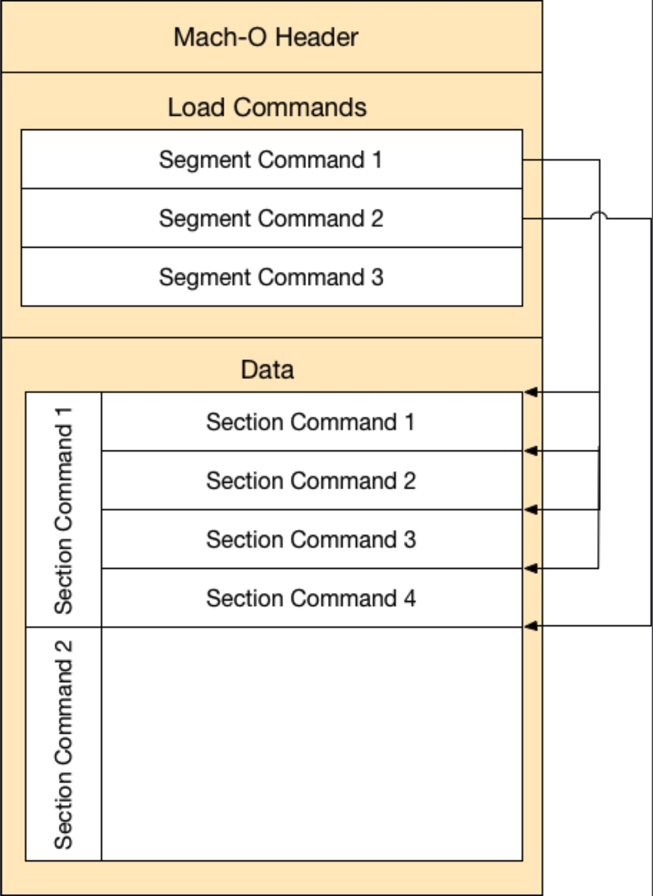

# Hello Mach-O
Mach-O是一种文件格式，作为编译好的程序，可以运行在苹果的系统上。对于Mach-O文件格式的了解对于调试和逆向都很重要。Mach-O定义的布局决定了可执行文件如何存储在硬盘上和如何加载到内存里。

知道汇编指令中引用的地址在内存中属于哪一块对于逆向是很重要的，但正向调试时，对于探索Mach-O有很多手段，比如
1. 可以在运行时监视外部的函数调用
2. 很快就可以定位一个单例的内存地址，而不用打断点
3. 可以监控和改变应用内变量的值，包括framework内的。
4. 可以安全的审核并保障没有内部的，隐蔽的消息发送出去，不管是string形式还是方法 调用形式。
这一章我们讲Mach-O相关的概念，下一章**Mach-O fun**会讲我们掌握了这些概念知识后能做些什么有意思的事。鉴于本章很多概念要讲，准备好咖啡因哦！

##术语
在直接进入C结构体相关内容前，我们先来从更高层面来看一下Mach-O的布局

下图就是所有编译后的可执行文件的结构。包括所有主程序，framework，内核扩展，以及任何在苹果平台编译后的文件。

第一部分是Mach-O的头文件，它存有以下信息：可以在哪些cpu下运行，这个可执行文件的类型（framework？还是独立可执行文件），有多少**load commands**，等。

load commands指明了如何加载程序，它是由C结构体组成的。load command
不同对应这个结构体的大小也就不尽相同。

有些load commands提供了如果加载**segments（段）**的指令。segment可以理解为一段有指定内存保护类型的内存。例如，可执行的代码应该只有可读和执行权限，不需要写的权限。

程序的其他部分，例如全局变量和单例，是需要可读和可写权限。但不需要执行权限。这也就意味着可执行代码和全区变量会存在不同的内存区域，就是不同的segmetn。

segment可以有0到多个**section**，看上面的图可以知道Segment 1指向了一块有4个section的偏移地址。Segment Command 2指向了一块有0个Section的偏移地址。而Segment command 3并没有指向任何偏移地址。

