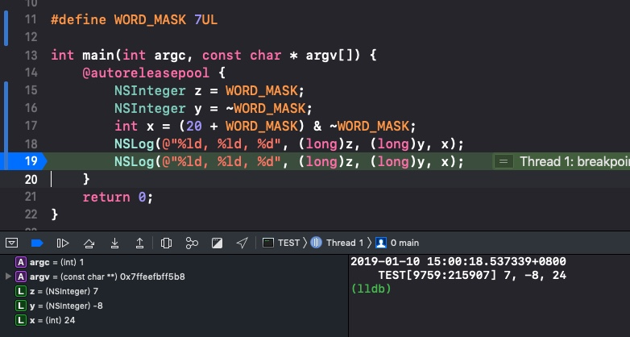

###Objective-C底层其实都是C/C++代码


Objective-C的对象是基于C的结构体实现的
###将Objective-C转换为C/C++
xcrun  -sdk  iphoneos  clang  -arch  arm64  -rewrite-objc  OC源文件  -o  输出的CPP文件
如果需要链接其他框架，使用-framework参数。比如-framework UIKit

###NSObject的底层实现
通过转换为C/C++语言可以看到类的底层实现，就是包含isa指针的结构体
```
struct NSObject_IMPL {
	Class isa;
};
```
###NSObject对象的大小
```
NSObject *obj = [[NSObject alloc] init];
NSLog(@"%zd", class_getInstanceSize([NSObject class]));
NSLog(@"%zd", malloc_size((__bridge const void *)obj));
```
分别打印的8和16。

下载[objc4](https://opensource.apple.com/tarballs/objc4/)的源码看一下**class_getInstanceSize()** 的实现
```
size_t class_getInstanceSize(Class cls)
{
   if (!cls) return 0;
   return cls->alignedInstanceSize();
}

// Class's ivar size rounded up to a pointer-size boundary.
uint32_t alignedInstanceSize() {
   return word_align(unalignedInstanceSize());  
}

#ifdef __LP64__
#   define WORD_SHIFT 3UL
#   define WORD_MASK 7UL
#   define WORD_BITS 64
#else
#   define WORD_SHIFT 2UL
#   define WORD_MASK 3UL
#   define WORD_BITS 32
#endif
static inline uint32_t word_align(uint32_t x) {
    return (x + WORD_MASK) & ~WORD_MASK;
}
```

可以看到在计算结构体的大小时有个内存对齐的操作(8的倍数)，不过这里不影响，因为指针刚好占8个字节。（后面会有需要对齐的例子）

可以看出**class_getInstanceSize()** 返回的是**Class's ivar size rounded up to a pointer-size boundary.** 也就是对齐过的成员大小，这里就是8了。

下面看下16怎么来的，我们去看下alloc的实现，它依次调用了如下函数

```
id _objc_rootAllocWithZone(Class cls, malloc_zone_t *zone)
id class_createInstance(Class cls, size_t extraBytes)
id _class_createInstanceFromZone(Class cls, size_t extraBytes, void *zone, 
                              bool cxxConstruct = true, 
                              size_t *outAllocatedSize = nil)
```
第3行的函数具体实现如下：
```
id
_class_createInstanceFromZone(Class cls, size_t extraBytes, void *zone, 
                              bool cxxConstruct = true, 
                              size_t *outAllocatedSize = nil)
{
    if (!cls) return nil;

    assert(cls->isRealized());

    // Read class's info bits all at once for performance
    bool hasCxxCtor = cls->hasCxxCtor();
    bool hasCxxDtor = cls->hasCxxDtor();
    bool fast = cls->canAllocNonpointer();

    size_t size = cls->instanceSize(extraBytes);
    if (outAllocatedSize) *outAllocatedSize = size;

    id obj;
    if (!zone  &&  fast) {
        obj = (id)calloc(1, size);
        if (!obj) return nil;
        obj->initInstanceIsa(cls, hasCxxDtor);
    } 
    else {
        if (zone) {
            obj = (id)malloc_zone_calloc ((malloc_zone_t *)zone, 1, size);
        } else {
            obj = (id)calloc(1, size);
        }
        if (!obj) return nil;

        // Use raw pointer isa on the assumption that they might be 
        // doing something weird with the zone or RR.
        obj->initIsa(cls);
    }

    if (cxxConstruct && hasCxxCtor) {
        obj = _objc_constructOrFree(obj, cls);
    }

    return obj;
}
```
可以看到**size** 的大小是**instanceSize()** 返回的，实现如下：
```
size_t instanceSize(size_t extraBytes) {
        size_t size = alignedInstanceSize() + extraBytes;
        // CF requires all objects be at least 16 bytes.
        if (size < 16) size = 16;
        return size;
    }
```
可以看到最小的大小就是16. 其实**alignedInstanceSize()** 就是上面看到的**class_getInstanceSize()** 返回的就是8.
所以最终的答案就是16个字节，只不过只有isa指针用掉了8个字节

那下面Car对象占多少内存呢？
```
@interface Car : NSObject
{
    @public
    int price;
    int wheels;
    int wheel;
}
@end
```
还是上面的打印，分别输出24和32（what???)

转为C/C++ 看具体实现
```
struct Car_IMPL {
	struct NSObject_IMPL NSObject_IVARS;
	int price;
	int wheels;
	int windows;
};
```
指针占8个字节，int占4个字节，实际用20个字节就够了。

首先是class_getInstanceSize输出24的原因，我们根据上面已经知道计算结构体大小时会有个内存对齐的操作，需要20的话，对齐后就是24了，我们测试一下

这样就可以得出**class_getInstanceSize**返回24的缘由了。

然后就是输出32的原因了，看下创建对象的核心代码
```
size_t size = cls->instanceSize(extraBytes);
if (outAllocatedSize) *outAllocatedSize = size;

id obj;
if (!zone  &&  fast) {
    obj = (id)calloc(1, size);
    if (!obj) return nil;
    obj->initInstanceIsa(cls, hasCxxDtor);
  } 
```
我们知道size就是24了，（和**class_getInstanceSize**就差一个小于16则返回16的逻辑）
然后就是calloc申请了空间，我们可以下载[libmalloc](https://opensource.apple.com/tarballs/libmalloc/)看下calloc的具体实现
这个实现比较复杂，给出结论就是**系统分配内存的时候也会进行内存对齐，iOS返回的大小就是16的倍数以便提高访问效率*

具体实现可以关注下面这个量
```
#define NANO_MAX_SIZE			256 /* Buckets sized {16, 32, 48, ..., 256} */
```

总结：
- 需要注意的就是实际需要的大小，计算时内存对齐后的大小，系统分配时内存对齐后的大小。
- sizeof()和class_getInstanceSize()基本是一样的，都是计算大小，对齐方式默认也相同 。不同的是sizeof是编译时就确定了，class_getInstanceSize运行时才能确定 (计算时有内存对齐的操作）
- malloc_size() （分配时有内存对齐的操作）

这里涉及到编译器的内存对齐系数，默认是#pragma pack(8)。[参考地址1](https://www.jianshu.com/p/3294668e2d8c)，[参考地址2](https://www.zhihu.com/question/27862634)