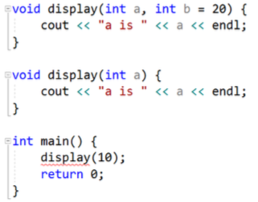

## C++
**学习工具：VS Community 2017**
### 基础知识

#### 函数重载（overload）
- description
    - 函数名相同
    - 参数个数不同、参数类型不同、参数顺序不同

- attention
    - 返回值类型和重载无关
    - 调用函数时，实参的隐式类型转换可能会产生二义性

- deep
    - 采用了name mangling技术
        - C++编译器默认会对符号名(变量名、函数名等)进行改编、修饰
        - 重载时会生成多个不同的函数名，不同编译器(MSVC、g++)有不同的生成规则
        - 通过打开【VS_Release_禁止优化】可以看到
#### extern "C"
- description 
    - 被修饰的的代码会按照C语言的方式去编译
    - 函数同时有声明和实现，函数声明一定要被extern "c"修饰，函数实现可以不修饰
- useage
    ```
    #ifdef __cplusplus
    extern "c"
    #endif
    
    void someCMethod();
    
    #ifdef __cplusplus
    }
    #endif
    ```

#### 默认参数
- description 
    - 允许函数设置默认参数，在调用时可根据情况省略实参
- attention
    - 默认参数只能按照右到左的顺序
    - 如果函数同时有声明、实现，默认参数只能放在函数声明中
    - 默认参数的值可以是常量、全局符号(全局变量、函数名)
    - 函数重载和默认参数可能会产生冲突，二义性（优先选择默认参数）
    
    
   
#### 内联函数
- description
    - 使用inline修饰函数的声明或者实现（建议都修饰）使其变成内联函数
    - 编译器会将函数调用直接展开为函数体代码
- attention
    - 可减少函数调用开销
    - 会增大代码体积
    - 内联函数不要行数太多（10行）
    - 有些函数即使声明为inline，也不一定会被编译器内联，比如递归函数
- 内联函数和宏
    - 都可以减少函数调用开销
    - 相比宏，内联函数多了语法检测和函数特性
    
